# 一. 进阶 - 算法设计

## 1. 图

### 1) 概念

图是由顶点（vertex）和边（edge）组成的数据结构，例如

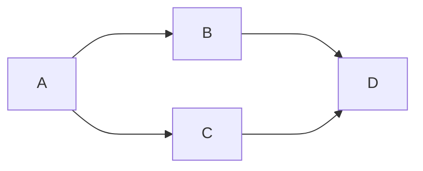

该图有四个顶点：A、B、C、D 以及四条有向边，有向图中，边是单向的

#### 有向 vs 无向

如果是无向图，那么边是双向的，下面是一个无向图的例子

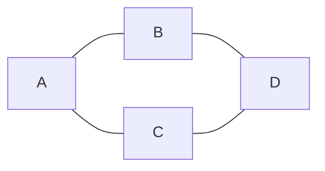

#### 度

**度**是指与该顶点相邻的边的数量

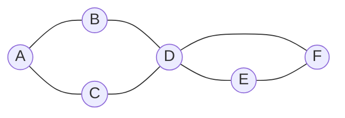

例如上图中

* A、B、C、E、F 这几个顶点度数为 2
* D 顶点度数为 4


有向图中，细分为**入度**和**出度**，参见下图

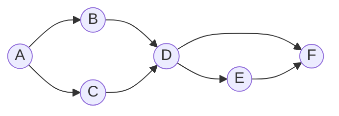

* A (2 out / 0 in)
* B、C、E (1 out / 1 in)
* D (2 out / 2 in)
* F (0 out / 2 in)


#### 权

边可以有权重，代表从源顶点到目标顶点的距离、费用、时间或其他度量。

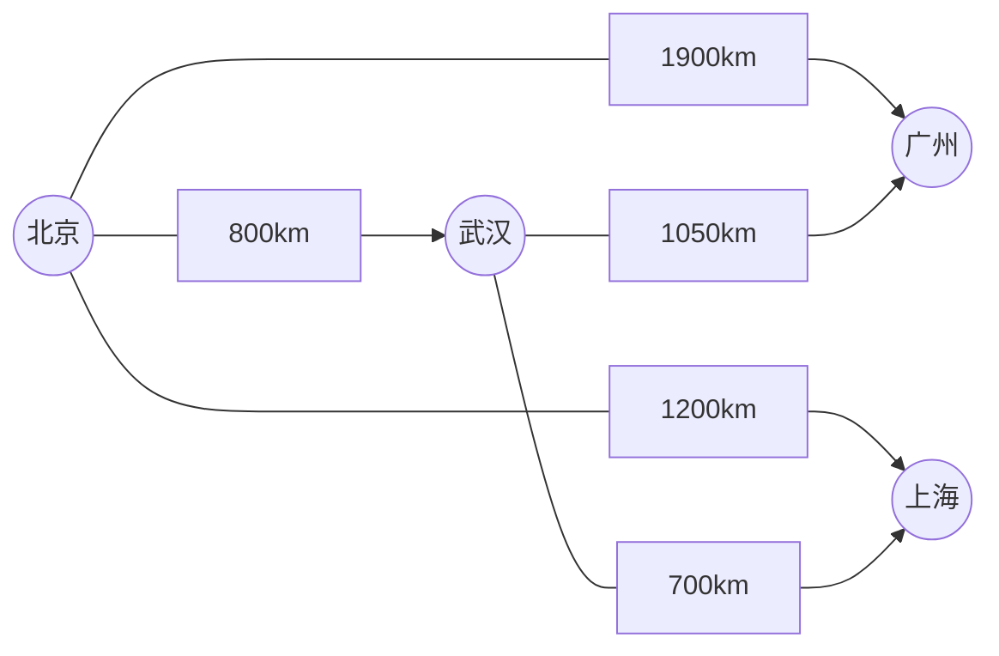

#### 路径

路径被定义为从一个顶点到另一个顶点的一系列连续边，例如上图中【北京】到【上海】有多条路径

* 北京 - 上海
* 北京 - 武汉 - 上海

路径长度

* 不考虑权重，长度就是边的数量
* 考虑权重，一般就是权重累加


#### 环

在有向图中，从一个顶点开始，可以通过若干条有向边返回到该顶点，那么就形成了一个环

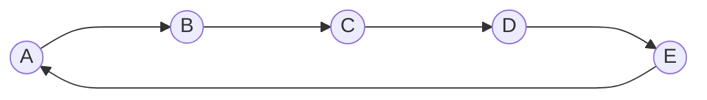


#### 图的连通性

如果两个顶点之间存在路径，则这两个顶点是连通的，所有顶点都连通，则该图被称之为连通图，若子图连通，则称为连通分量

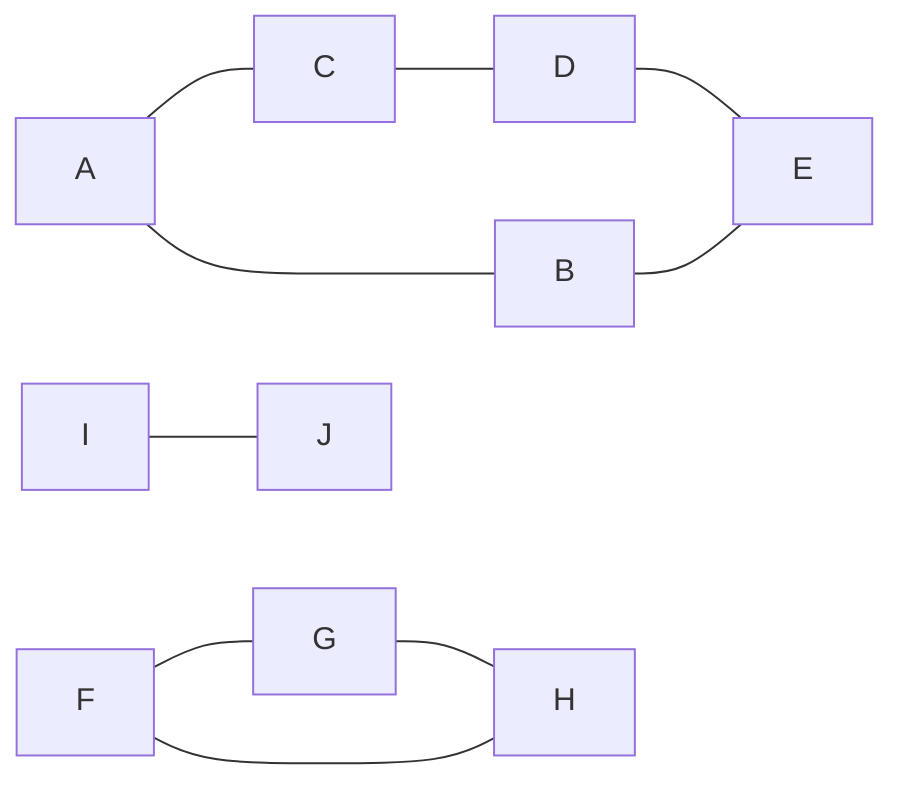


### 2) 图的表示

比如说，下面的图


用**邻接矩阵**可以表示为：

```
  A B C D
A 0 1 1 0
B 1 0 0 1 
C 1 0 0 1
D 0 1 1 0
```

用**邻接表**可以表示为：

```
A -> B -> C
B -> A -> D
C -> A -> D
D -> B -> C
```

有向图的例子


```
  A B C D
A 0 1 1 0
B 0 0 0 1
C 0 0 0 1
D 0 0 0 0
```

```
A - B - C
B - D
C - D
D - empty
```


### 3) Java 表示

顶点

```java
public class Vertex {
    String name;
    List<Edge> edges;
    
    // 拓扑排序相关
    int inDegree;
    int status; // 状态 0-未访问 1-访问中 2-访问过，用在拓扑排序

    // dfs, bfs 相关
    boolean visited;

    // 求解最短距离相关
    private static final int INF = Integer.MAX_VALUE;
    int dist = INF;
    Vertex prev = null;
}
```

边

```java
public class Edge {

    Vertex linked;
    int weight;

    public Edge(Vertex linked) {
        this(linked, 1);
    }

    public Edge(Vertex linked, int weight) {
        this.linked = linked;
        this.weight = weight;
    }
}
```


### 4) DFS

```java
public class Dfs {
    public static void main(String[] args) {
        Vertex v1 = new Vertex("v1");
        Vertex v2 = new Vertex("v2");
        Vertex v3 = new Vertex("v3");
        Vertex v4 = new Vertex("v4");
        Vertex v5 = new Vertex("v5");
        Vertex v6 = new Vertex("v6");

        v1.edges = List.of(new Edge(v3), new Edge(v2), new Edge(v6));
        v2.edges = List.of(new Edge(v4));
        v3.edges = List.of(new Edge(v4), new Edge(v6));
        v4.edges = List.of(new Edge(v5));
        v5.edges = List.of();
        v6.edges = List.of(new Edge(v5));

        dfs1(v1);
    }

    private static void dfs2(Vertex v) {
        LinkedList<Vertex> stack = new LinkedList<>();
        stack.push(v);
        while (!stack.isEmpty()) {
            Vertex pop = stack.pop();
            pop.visited = true;
            System.out.println(pop.name);
            for (Edge edge : pop.edges) {
                if (!edge.linked.visited) {
                    stack.push(edge.linked);
                }
            }
        }
    }

    private static void dfs1(Vertex v) {
        v.visited = true;
        System.out.println(v.name);
        for (Edge edge : v.edges) {
            if (!edge.linked.visited) {
                dfs(edge.linked);
            }
        }
    }
}
```


### 5) BFS

```java
public class Bfs {
    public static void main(String[] args) {
        Vertex v1 = new Vertex("v1");
        Vertex v2 = new Vertex("v2");
        Vertex v3 = new Vertex("v3");
        Vertex v4 = new Vertex("v4");
        Vertex v5 = new Vertex("v5");
        Vertex v6 = new Vertex("v6");

        v1.edges = List.of(new Edge(v3), new Edge(v2), new Edge(v6));
        v2.edges = List.of(new Edge(v4));
        v3.edges = List.of(new Edge(v4), new Edge(v6));
        v4.edges = List.of(new Edge(v5));
        v5.edges = List.of();
        v6.edges = List.of(new Edge(v5));

        bfs(v1);
    }

    private static void bfs(Vertex v) {
        LinkedList<Vertex> queue = new LinkedList<>();
        v.visited = true;
        queue.offer(v);
        while (!queue.isEmpty()) {
            Vertex poll = queue.poll();
            System.out.println(poll.name);
            for (Edge edge : poll.edges) {
                if (!edge.linked.visited) {
                    edge.linked.visited = true;
                    queue.offer(edge.linked);
                }
            }
        }
    }
}
```


### 6) 拓扑排序

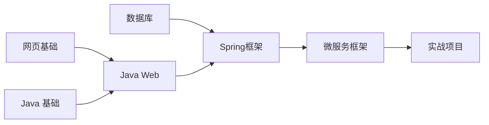

#### Kahn

```java
public class TopologicalSort {
    public static void main(String[] args) {
        Vertex v1 = new Vertex("网页基础");
        Vertex v2 = new Vertex("Java基础");
        Vertex v3 = new Vertex("JavaWeb");
        Vertex v4 = new Vertex("Spring框架");
        Vertex v5 = new Vertex("微服务框架");
        Vertex v6 = new Vertex("数据库");
        Vertex v7 = new Vertex("实战项目");

        v1.edges = List.of(new Edge(v3)); // +1
        v2.edges = List.of(new Edge(v3)); // +1
        v3.edges = List.of(new Edge(v4));
        v6.edges = List.of(new Edge(v4));
        v4.edges = List.of(new Edge(v5));
        v5.edges = List.of(new Edge(v7));
        v7.edges = List.of();

        List<Vertex> graph = List.of(v1, v2, v3, v4, v5, v6, v7);
        // 1. 统计每个顶点的入度
        for (Vertex v : graph) {
            for (Edge edge : v.edges) {
                edge.linked.inDegree++;
            }
        }
        /*for (Vertex vertex : graph) {
            System.out.println(vertex.name + " " + vertex.inDegree);
        }*/
        // 2. 将入度为0的顶点加入队列
        LinkedList<Vertex> queue = new LinkedList<>();
        for (Vertex v : graph) {
            if (v.inDegree == 0) {
                queue.offer(v);
            }
        }
        // 3. 队列中不断移除顶点，每移除一个顶点，把它相邻顶点入度减1，若减到0则入队
        List<String> result = new ArrayList<>();
        while (!queue.isEmpty()) {
            Vertex poll = queue.poll();
//            System.out.println(poll.name);
            result.add(poll.name);
            for (Edge edge : poll.edges) {
                edge.linked.inDegree--;
                if (edge.linked.inDegree == 0) {
                    queue.offer(edge.linked);
                }
            }
        }
        if (result.size() != graph.size()) {
            System.out.println("出现环");
        } else {
            for (String key : result) {
                System.out.println(key);
            }
        }
    }
}
```


#### DFS

```java
public class TopologicalSortDFS {

    public static void main(String[] args) {
        Vertex v1 = new Vertex("网页基础");
        Vertex v2 = new Vertex("Java基础");
        Vertex v3 = new Vertex("JavaWeb");
        Vertex v4 = new Vertex("Spring框架");
        Vertex v5 = new Vertex("微服务框架");
        Vertex v6 = new Vertex("数据库");
        Vertex v7 = new Vertex("实战项目");

        v1.edges = List.of(new Edge(v3));
        v2.edges = List.of(new Edge(v3));
        v3.edges = List.of(new Edge(v4));
        v6.edges = List.of(new Edge(v4));
        v4.edges = List.of(new Edge(v5));
        v5.edges = List.of(new Edge(v7));
        v7.edges = List.of();

        List<Vertex> graph = List.of(v1, v2, v3, v4, v5, v6, v7);
        LinkedList<String> result = new LinkedList<>();
        for (Vertex v : graph) {
            if(v.status==0) {
                dfs(v, result);
            }
        }
        System.out.println(result);
    }

    private static void dfs(Vertex v, LinkedList<String> result) {
        if (v.status == 2) {
            return;
        }
        if (v.status == 1) {
            throw new RuntimeException("发现环");
        }
        v.status = 1;
        for (Edge edge : v.edges) {
            dfs(edge.linked, result);
        }
        v.status = 2;
        result.push(v.name);
    }
}
```


### 7) 最短路径

#### Dijkstra


**Edsger Wybe Dijkstra**

> 艾兹格·维布·迪克斯特拉（Edsger Wybe Dijkstra，/ˈdaɪkstrə/ DYKE-strə；荷兰语：[ˈɛtsxər ˈʋibə ˈdɛikstra] 1930年5月11日-2002年8月6日）是一位荷兰计算机科学家、程序员、软件工程师、系统科学家和科学散文家。他因对开发结构化编程语言做出的基础贡献而获得了1972年的图灵奖，并担任德克萨斯大学奥斯汀分校的斯伦贝谢百年计算机科学主席，任职时间从1984年到2000年。在他于2002年去世前不久，他因其在程序计算的自稳定性方面的工作而获得了ACM PODC分布式计算有影响力论文奖。为了纪念他，该年度奖项在接下来的一年更名为迪克斯特拉奖。
>
> 迪克斯特拉在计算机科学领域的贡献
>
> 1. 最短路径算法，也称为迪克斯特拉算法，现代计算机科学本科课程中广泛教授
> 2. Shunting yard算法
> 3. THE OS 操作系统
> 4. 银行家算法
> 5. 用于协调多个处理器和程序的信号量构造
> 6. 在分布式计算领域提出概念：自稳定性

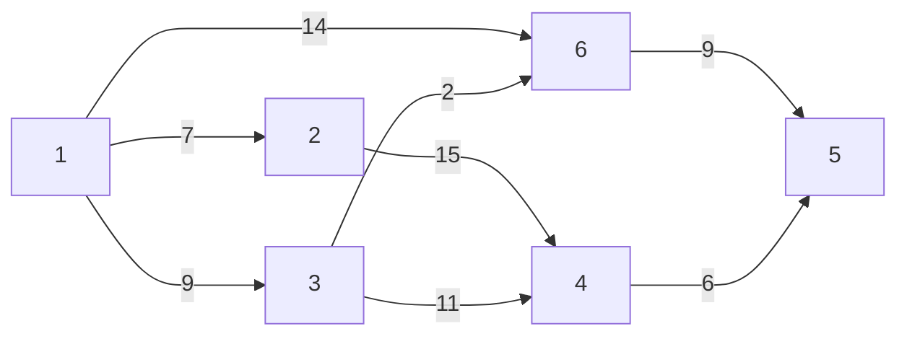

算法描述：

1. 将所有顶点标记为未访问。创建一个未访问顶点的集合。
2. 为每个顶点分配一个临时距离值
   * 对于我们的初始顶点，将其设置为零
   * 对于所有其他顶点，将其设置为无穷大。
3. 每次选择最小临时距离的未访问顶点，作为新的当前顶点
4. 对于当前顶点，遍历其所有未访问的邻居，并更新它们的临时距离为更小
   * 例如，1->6 的距离是 14，而1->3->6 的距离是11。这时将距离更新为 11
   * 否则，将保留上次距离值
5. 当前顶点的邻居处理完成后，把它从未访问集合中删除

```java
public class Dijkstra {
    public static void main(String[] args) {
        Vertex v1 = new Vertex("v1");
        Vertex v2 = new Vertex("v2");
        Vertex v3 = new Vertex("v3");
        Vertex v4 = new Vertex("v4");
        Vertex v5 = new Vertex("v5");
        Vertex v6 = new Vertex("v6");

        v1.edges = List.of(new Edge(v3, 9), new Edge(v2, 7), new Edge(v6, 14));
        v2.edges = List.of(new Edge(v4, 15));
        v3.edges = List.of(new Edge(v4, 11), new Edge(v6, 2));
        v4.edges = List.of(new Edge(v5, 6));
        v5.edges = List.of();
        v6.edges = List.of(new Edge(v5, 9));

        List<Vertex> graph = List.of(v1, v2, v3, v4, v5, v6);

        dijkstra(graph, v1);
    }

    private static void dijkstra(List<Vertex> graph, Vertex source) {
        ArrayList<Vertex> list = new ArrayList<>(graph);
        source.dist = 0;

        while (!list.isEmpty()) {
            // 3. 选取当前顶点
            Vertex curr = chooseMinDistVertex(list);
            // 4. 更新当前顶点邻居距离
            updateNeighboursDist(curr, list);
            // 5. 移除当前顶点
            list.remove(curr);
        }

        for (Vertex v : graph) {
            System.out.println(v.name + " " + v.dist);
        }
    }

    private static void updateNeighboursDist(Vertex curr, ArrayList<Vertex> list) {
        for (Edge edge : curr.edges) {
            Vertex n = edge.linked;
            if (list.contains(n)) {
                int dist = curr.dist + edge.weight;
                if (dist < n.dist) {
                    n.dist = dist;
                }
            }
        }
    }

    private static Vertex chooseMinDistVertex(ArrayList<Vertex> list) {
        Vertex min = list.get(0);
        for (int i = 1; i < list.size(); i++) {
            if (list.get(i).dist < min.dist) {
                min = list.get(i);
            }
        }
        return min;
    }

}
```


改进 - 优先级队列

1. 创建一个优先级队列，放入所有顶点（队列大小会达到边的数量）
2. 为每个顶点分配一个临时距离值
   * 对于我们的初始顶点，将其设置为零
   * 对于所有其他顶点，将其设置为无穷大。
3. 每次选择最小临时距离的未访问顶点，作为新的当前顶点
4. 对于当前顶点，遍历其所有未访问的邻居，并更新它们的临时距离为更小，若距离更新需加入队列
   * 例如，1->6 的距离是 14，而1->3->6 的距离是11。这时将距离更新为 11
   * 否则，将保留上次距离值
5. 当前顶点的邻居处理完成后，把它从队列中删除

```java
public class DijkstraPriorityQueue {
    public static void main(String[] args) {
        Vertex v1 = new Vertex("v1");
        Vertex v2 = new Vertex("v2");
        Vertex v3 = new Vertex("v3");
        Vertex v4 = new Vertex("v4");
        Vertex v5 = new Vertex("v5");
        Vertex v6 = new Vertex("v6");

        v1.edges = List.of(new Edge(v3, 9), new Edge(v2, 7), new Edge(v6, 14));
        v2.edges = List.of(new Edge(v4, 15));
        v3.edges = List.of(new Edge(v4, 11), new Edge(v6, 2));
        v4.edges = List.of(new Edge(v5, 6));
        v5.edges = List.of();
        v6.edges = List.of(new Edge(v5, 9));

        List<Vertex> graph = List.of(v1, v2, v3, v4, v5, v6);

        dijkstra(graph, v1);
    }

    private static void dijkstra(List<Vertex> graph, Vertex source) {
        PriorityQueue<Vertex> queue = new PriorityQueue<>(Comparator.comparingInt(v -> v.dist));
        source.dist = 0;
        for (Vertex v : graph) {
            queue.offer(v);
        }

        while (!queue.isEmpty()) {
            System.out.println(queue);
            // 3. 选取当前顶点
            Vertex curr = queue.peek();
            // 4. 更新当前顶点邻居距离
            if(!curr.visited) {
                updateNeighboursDist(curr, queue);
                curr.visited = true;
            }
            // 5. 移除当前顶点
            queue.poll();
        }

        for (Vertex v : graph) {
            System.out.println(v.name + " " + v.dist + " " + (v.prev != null ? v.prev.name : "null"));
        }
    }

    private static void updateNeighboursDist(Vertex curr, PriorityQueue<Vertex> queue) {
        for (Edge edge : curr.edges) {
            Vertex n = edge.linked;
            if (!n.visited) {
                int dist = curr.dist + edge.weight;
                if (dist < n.dist) {
                    n.dist = dist;
                    n.prev = curr;
                    queue.offer(n);
                }
            }
        }
    }

}
```


**问题**

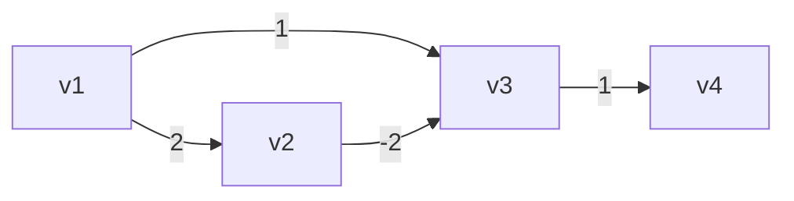

按照 Dijkstra 算法，得出

* v1 -> v2 最短距离2
* v1 -> v3 最短距离1
* v1 -> v4 最短距离2

事实应当是

* v1 -> v2 最短距离2
* v1 -> v3 最短距离0
* v1 -> v4 最短距离1


#### Bellman-Ford

```java
public class BellmanFord {
    public static void main(String[] args) {
        // 正常情况
        /*Vertex v1 = new Vertex("v1");
        Vertex v2 = new Vertex("v2");
        Vertex v3 = new Vertex("v3");
        Vertex v4 = new Vertex("v4");
        Vertex v5 = new Vertex("v5");
        Vertex v6 = new Vertex("v6");

        v1.edges = List.of(new Edge(v3, 9), new Edge(v2, 7), new Edge(v6, 14));
        v2.edges = List.of(new Edge(v4, 15));
        v3.edges = List.of(new Edge(v4, 11), new Edge(v6, 2));
        v4.edges = List.of(new Edge(v5, 6));
        v5.edges = List.of();
        v6.edges = List.of(new Edge(v5, 9));

        List<Vertex> graph = List.of(v4, v5, v6, v1, v2, v3);*/

        // 负边情况
        /*Vertex v1 = new Vertex("v1");
        Vertex v2 = new Vertex("v2");
        Vertex v3 = new Vertex("v3");
        Vertex v4 = new Vertex("v4");

        v1.edges = List.of(new Edge(v2, 2), new Edge(v3, 1));
        v2.edges = List.of(new Edge(v3, -2));
        v3.edges = List.of(new Edge(v4, 1));
        v4.edges = List.of();
        List<Vertex> graph = List.of(v1, v2, v3, v4);*/

        // 负环情况
        Vertex v1 = new Vertex("v1");
        Vertex v2 = new Vertex("v2");
        Vertex v3 = new Vertex("v3");
        Vertex v4 = new Vertex("v4");

        v1.edges = List.of(new Edge(v2, 2));
        v2.edges = List.of(new Edge(v3, -4));
        v3.edges = List.of(new Edge(v4, 1), new Edge(v1, 1));
        v4.edges = List.of();
        List<Vertex> graph = List.of(v1, v2, v3, v4);

        bellmanFord(graph, v1);
    }

    private static void bellmanFord(List<Vertex> graph, Vertex source) {
        source.dist = 0;
        int size = graph.size();
        // 1. 进行 顶点个数 - 1 轮处理
        for (int i = 0; i < size - 1; i++) {
            // 2. 遍历所有的边
            for (Vertex s : graph) {
                for (Edge edge : s.edges) {
                    // 3. 处理每一条边
                    Vertex e = edge.linked;
                    if (s.dist != Integer.MAX_VALUE && s.dist + edge.weight < e.dist) {
                        e.dist = s.dist + edge.weight;
                        e.prev = s;
                    }
                }
            }
        }
        for (Vertex v : graph) {
            System.out.println(v + " " + (v.prev != null ? v.prev.name : "null"));
        }
    }
}
```


**负环**

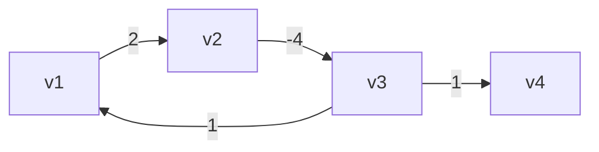

如果在【顶点-1】轮处理完成后，还能继续找到更短距离，表示发现了负环


#### Floyd-Warshall

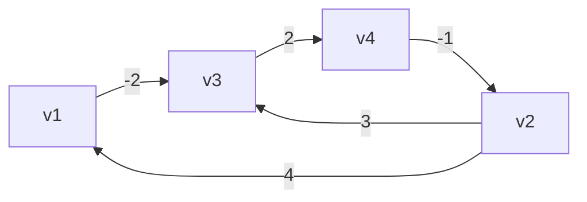

```java
public class FloydWarshall {
    public static void main(String[] args) {
        Vertex v1 = new Vertex("v1");
        Vertex v2 = new Vertex("v2");
        Vertex v3 = new Vertex("v3");
        Vertex v4 = new Vertex("v4");

        v1.edges = List.of(new Edge(v3, -2));
        v2.edges = List.of(new Edge(v1, 4), new Edge(v3, 3));
        v3.edges = List.of(new Edge(v4, 2));
        v4.edges = List.of(new Edge(v2, -1));
        List<Vertex> graph = List.of(v1, v2, v3, v4);

        /*
                直接连通
                v1  v2  v3  v4
            v1  0   ∞   -2  ∞
            v2  4   0   3   ∞
            v3  ∞   ∞   0   2
            v4  ∞   -1  ∞   0

                k=0 借助v1到达其它顶点
                v1  v2  v3  v4
            v1  0   ∞   -2  ∞
            v2  4   0   2   ∞
            v3  ∞   ∞   0   2
            v4  ∞   -1  ∞   0

                k=1 借助v2到达其它顶点
                v1  v2  v3  v4
            v1  0   ∞   -2  ∞
            v2  4   0   2   ∞
            v3  ∞   ∞   0   2
            v4  3   -1  1   0

                k=2 借助v3到达其它顶点
                v1  v2  v3  v4
            v1  0   ∞   -2  0
            v2  4   0   2   4
            v3  ∞   ∞   0   2
            v4  3   -1  1   0

                k=3 借助v4到达其它顶点
                v1  v2  v3  v4
            v1  0   -1   -2  0
            v2  4   0   2   4
            v3  5   1   0   2
            v4  3   -1  1   0
         */
        floydWarshall(graph);
    }

    static void floydWarshall(List<Vertex> graph) {
        int size = graph.size();
        int[][] dist = new int[size][size];
        Vertex[][] prev = new Vertex[size][size];
        // 1）初始化
        for (int i = 0; i < size; i++) {
            Vertex v = graph.get(i); // v1 (v3)
            Map<Vertex, Integer> map = v.edges.stream().collect(Collectors.toMap(e -> e.linked, e -> e.weight));
            for (int j = 0; j < size; j++) {
                Vertex u = graph.get(j); // v3
                if (v == u) {
                    dist[i][j] = 0;
                } else {
                    dist[i][j] = map.getOrDefault(u, Integer.MAX_VALUE);
                    prev[i][j] = map.get(u) != null ? v : null;
                }
            }
        }
        print(prev);
        // 2）看能否借路到达其它顶点
        /*
            v2->v1          v1->v?
            dist[1][0]   +   dist[0][0]
            dist[1][0]   +   dist[0][1]
            dist[1][0]   +   dist[0][2]
            dist[1][0]   +   dist[0][3]
         */
        for (int k = 0; k < size; k++) {
            for (int i = 0; i < size; i++) {
                for (int j = 0; j < size; j++) {
//                    dist[i][k]   +   dist[k][j] // i行的顶点，借助k顶点，到达j列顶点
//                    dist[i][j]                  // i行顶点，直接到达j列顶点
                    if (dist[i][k] != Integer.MAX_VALUE &&
                            dist[k][j] != Integer.MAX_VALUE &&
                            dist[i][k] + dist[k][j] < dist[i][j]) {
                        dist[i][j] = dist[i][k] + dist[k][j];
                        prev[i][j] = prev[k][j];
                    }
                }
            }
//            print(dist);
        }
        print(prev);
    }

    static void path(Vertex[][] prev, List<Vertex> graph, int i, int j) {
        LinkedList<String> stack = new LinkedList<>();
        System.out.print("[" + graph.get(i).name + "," + graph.get(j).name + "] ");
        stack.push(graph.get(j).name);
        while (i != j) {
            Vertex p = prev[i][j];
            stack.push(p.name);
            j = graph.indexOf(p);
        }
        System.out.println(stack);
    }

    static void print(int[][] dist) {
        System.out.println("-------------");
        for (int[] row : dist) {
            System.out.println(Arrays.stream(row).boxed()
                    .map(x -> x == Integer.MAX_VALUE ? "∞" : String.valueOf(x))
                    .map(s -> String.format("%2s", s))
                    .collect(Collectors.joining(",", "[", "]")));
        }
    }

    static void print(Vertex[][] prev) {
        System.out.println("-------------------------");
        for (Vertex[] row : prev) {
            System.out.println(Arrays.stream(row).map(v -> v == null ? "null" : v.name)
                    .map(s -> String.format("%5s", s))
                    .collect(Collectors.joining(",", "[", "]")));
        }
    }

}
```


**负环**

如果在 3 层循环结束后，在 dist 数组的对角线处（i==j 处）发现了负数，表示出现了负环


### 8) 最小生成树

#### Prim

```java
public class Prim {
    public static void main(String[] args) {
        Vertex v1 = new Vertex("v1");
        Vertex v2 = new Vertex("v2");
        Vertex v3 = new Vertex("v3");
        Vertex v4 = new Vertex("v4");
        Vertex v5 = new Vertex("v5");
        Vertex v6 = new Vertex("v6");
        Vertex v7 = new Vertex("v7");

        v1.edges = List.of(new Edge(v2, 2), new Edge(v3, 4), new Edge(v4, 1));
        v2.edges = List.of(new Edge(v1, 2), new Edge(v4, 3), new Edge(v5, 10));
        v3.edges = List.of(new Edge(v1, 4), new Edge(v4, 2), new Edge(v6, 5));
        v4.edges = List.of(new Edge(v1, 1), new Edge(v2, 3), new Edge(v3, 2),
                new Edge(v5, 7), new Edge(v6, 8), new Edge(v7, 4));
        v5.edges = List.of(new Edge(v2, 10), new Edge(v4, 7), new Edge(v7, 6));
        v6.edges = List.of(new Edge(v3, 5), new Edge(v4, 8), new Edge(v7, 1));
        v7.edges = List.of(new Edge(v4, 4), new Edge(v5, 6), new Edge(v6, 1));

        List<Vertex> graph = List.of(v1, v2, v3, v4, v5, v6, v7);

        prim(graph, v1);

    }

    static void prim(List<Vertex> graph, Vertex source) {
        ArrayList<Vertex> list = new ArrayList<>(graph);
        source.dist = 0;

        while (!list.isEmpty()) {
            Vertex min = chooseMinDistVertex(list);
            updateNeighboursDist(min);
            list.remove(min);
            min.visited = true;
            System.out.println("---------------");
            for (Vertex v : graph) {
                System.out.println(v);
            }
        }


    }

    private static void updateNeighboursDist(Vertex curr) {
        for (Edge edge : curr.edges) {
            Vertex n = edge.linked;
            if (!n.visited) {
                int dist = edge.weight;
                if (dist < n.dist) {
                    n.dist = dist;
                    n.prev = curr;
                }
            }
        }
    }

    private static Vertex chooseMinDistVertex(ArrayList<Vertex> list) {
        Vertex min = list.get(0);
        for (int i = 1; i < list.size(); i++) {
            if (list.get(i).dist < min.dist) {
                min = list.get(i);
            }
        }
        return min;
    }
}
```


#### Kruskal

```java
public class Kruskal {
    static class Edge implements Comparable<Edge> {
        List<Vertex> vertices;
        int start;
        int end;
        int weight;

        public Edge(List<Vertex> vertices, int start, int end, int weight) {
            this.vertices = vertices;
            this.start = start;
            this.end = end;
            this.weight = weight;
        }

        public Edge(int start, int end, int weight) {
            this.start = start;
            this.end = end;
            this.weight = weight;
        }

        @Override
        public int compareTo(Edge o) {
            return Integer.compare(this.weight, o.weight);
        }

        @Override
        public String toString() {
            return vertices.get(start).name + "<->" + vertices.get(end).name + "(" + weight + ")";
        }
    }

    public static void main(String[] args) {
        Vertex v1 = new Vertex("v1");
        Vertex v2 = new Vertex("v2");
        Vertex v3 = new Vertex("v3");
        Vertex v4 = new Vertex("v4");
        Vertex v5 = new Vertex("v5");
        Vertex v6 = new Vertex("v6");
        Vertex v7 = new Vertex("v7");

        List<Vertex> vertices = List.of(v1, v2, v3, v4, v5, v6, v7);
        PriorityQueue<Edge> queue = new PriorityQueue<>(List.of(
                new Edge(vertices,0, 1, 2),
                new Edge(vertices,0, 2, 4),
                new Edge(vertices,0, 3, 1),
                new Edge(vertices,1, 3, 3),
                new Edge(vertices,1, 4, 10),
                new Edge(vertices,2, 3, 2),
                new Edge(vertices,2, 5, 5),
                new Edge(vertices,3, 4, 7),
                new Edge(vertices,3, 5, 8),
                new Edge(vertices,3, 6, 4),
                new Edge(vertices,4, 6, 6),
                new Edge(vertices,5, 6, 1)
        ));

        kruskal(vertices.size(), queue);
    }

    static void kruskal(int size, PriorityQueue<Edge> queue) {
        List<Edge> result = new ArrayList<>();
        DisjointSet set = new DisjointSet(size);
        while (result.size() < size - 1) {
            Edge poll = queue.poll();
            int s = set.find(poll.start);
            int e = set.find(poll.end);
            if (s != e) {
                result.add(poll);
                set.union(s, e);
            }
        }

        for (Edge edge : result) {
            System.out.println(edge);
        }
    }
}
```


### 9) 不相交集合（并查集合）

#### 基础

```java
public class DisjointSet {
    int[] s;
    // 索引对应顶点
    // 元素是用来表示与之有关系的顶点
    /*
        索引  0  1  2  3  4  5  6
        元素 [0, 1, 2, 3, 4, 5, 6] 表示一开始顶点直接没有联系（只与自己有联系）

    */

    public DisjointSet(int size) {
        s = new int[size];
        for (int i = 0; i < size; i++) {
            s[i] = i;
        }
    }

    // find 是找到老大
    public int find(int x) {
        if (x == s[x]) {
            return x;
        }
        return find(s[x]);
    }

    // union 是让两个集合“相交”，即选出新老大，x、y 是原老大索引
    public void union(int x, int y) {
        s[y] = x;
    }

    @Override
    public String toString() {
        return Arrays.toString(s);
    }

}
```


#### 路径压缩

```java
public int find(int x) { // x = 2
    if (x == s[x]) {
        return x;
    }
    return s[x] = find(s[x]); // 0    s[2]=0
}
```


#### Union By Size

```java
public class DisjointSetUnionBySize {
    int[] s;
    int[] size;
    public DisjointSetUnionBySize(int size) {
        s = new int[size];
        this.size = new int[size];
        for (int i = 0; i < size; i++) {
            s[i] = i;
            this.size[i] = 1;
        }
    }

    // find 是找到老大 - 优化：路径压缩
    public int find(int x) { // x = 2
        if (x == s[x]) {
            return x;
        }
        return s[x] = find(s[x]); // 0    s[2]=0
    }

    // union 是让两个集合“相交”，即选出新老大，x、y 是原老大索引
    public void union(int x, int y) {
//        s[y] = x;
        if (size[x] < size[y]) {
            int t = x;
            x = y;
            y = t;
        }
        s[y] = x;
        size[x] = size[x] + size[y];
    }

    @Override
    public String toString() {
        return "内容："+Arrays.toString(s) + "\n大小：" + Arrays.toString(size);
    }

    public static void main(String[] args) {
        DisjointSetUnionBySize set = new DisjointSetUnionBySize(5);

        set.union(1, 2);
        set.union(3, 4);
        set.union(1, 3);
        System.out.println(set);
    }


}
```


### 图-相关题目

| 题目编号 | 题目标题               | 算法思想         |
| -------- | ---------------------- | ---------------- |
| 547      | 省份数量               | DFS、BFS、并查集 |
| 797      | 所有可能路径           | DFS、BFS         |
| 1584     | 连接所有点的最小费用   | 最小生成树       |
| 743      | 网络延迟时间           | 单源最短路径     |
| 787      | K 站中转内最便宜的航班 | 单源最短路径     |
| 207      | 课程表                 | 拓扑排序         |
| 210      | 课程表 II              | 拓扑排序         |


## 2. 算法设计 - Greedy algorithm

### 1) 贪心例子

称之为贪心算法或贪婪算法，核心思想是

1. 将寻找最优解的问题分为若干个步骤
2. 每一步骤都采用贪心原则，选取当前最优解
3. 因为没有考虑所有可能，局部最优的堆叠**不一定**让最终解最优


贪心算法是一种在每一步选择中都采取在当前状态下最好或最优(即最有利)的选择，从而希望导致结果是最好或最优的算法。这种算法通常用于求解优化问题，如最小生成树、背包问题等。

贪心算法的应用：
1. 背包问题：给定一组物品和一个背包，每个物品有一定的重量和价值，要求在不超过背包容量的情况下，尽可能多地装入物品。
2. 活动选择问题：在一个活动集合中，每次只能参加一个活动，问如何安排时间以最大化所有活动的收益。
3. 编辑距离问题：给定两个字符串，求它们之间的最小编辑距离(即将一个字符串转换为另一个字符串所需的最少操作次数)。
4. 网络流问题：给定一张有向图和一些起点和终点，求最大流量。
5. 找零问题：给定一定数量的硬币和需要找零的金额，求使用最少的硬币数。

常见问题及解答：
1. 贪心算法一定会找到最优解吗？
答：不一定。贪心算法只保证在每一步选择中都是最优的，但并不能保证整个问题的最优解。例如，背包问题中的贪心算法可能会导致最后一个物品没有被装入背包。
2. 如何判断一个问题是否适合用贪心算法解决？
答：一个问题如果可以用递归的方式分解成若干个子问题，且每个子问题都有明确的最优解(即局部最优),那么这个问题就可以用贪心算法解决。
3. 贪心算法的时间复杂度是多少？
答：贪心算法的时间复杂度取决于问题的规模和具体实现。一般来说，对于规模较小的问题，贪心算法的时间复杂度可以达到O(nlogn)或O(n^2);对于规模较大的问题，可能需要O(n^3)或更高。


几个贪心的例子

#### Dijkstra

```java
// ...
while (!list.isEmpty()) {
    // 选取当前【距离最小】的顶点
    Vertex curr = chooseMinDistVertex(list);
    // 更新当前顶点邻居距离
    updateNeighboursDist(curr);
    // 移除当前顶点
    list.remove(curr);
    // 标记当前顶点已经处理过
    curr.visited = true;
}
```

* 没找到最短路径的例子：负边存在时，可能得不到正确解
* 问题出在贪心的原则会认为本次已经找到了该顶点的最短路径，下次不会再处理它（curr.visited = true）
* 与之对比，Bellman-Ford 并没有考虑局部距离最小的顶点，而是每次都处理所有边，所以不会出错，当然效率不如 Dijkstra

#### Prim

```java
// ...
while (!list.isEmpty()) {
    // 选取当前【距离最小】的顶点
    Vertex curr = chooseMinDistVertex(list);
    // 更新当前顶点邻居距离
    updateNeighboursDist(curr);
    // 移除当前顶点
    list.remove(curr);
    // 标记当前顶点已经处理过
    curr.visited = true;
}
```

#### Kruskal

```java
// ...
while (list.size() < size - 1) {
    // 选取当前【距离最短】的边
    Edge poll = queue.poll();
    // 判断两个集合是否相交
    int i = set.find(poll.start);
    int j = set.find(poll.end);
    if (i != j) { // 未相交
        list.add(poll);
        set.union(i, j); // 相交
    }
}
```

其它贪心的例子

* 选择排序、堆排序
* 拓扑排序
* 并查集合中的 union by size 和 union by height
* 哈夫曼编码
* 钱币找零，英文搜索关键字
  * change-making problem
  * find Minimum number of Coins

* 任务编排
* 求复杂问题的近似解


### 2) 零钱兑换问题

#### 有几个解（零钱兑换 II）

```java
public class Leetcode518 {
    public int change(int[] coins, int amount) {
        return rec(0, coins, amount, new LinkedList<>(), true);
    }

    /**
     * 求凑成剩余金额的解的个数
     *
     * @param index     当前硬币索引
     * @param coins     硬币面值数组
     * @param remainder 剩余金额
     * @param stack     -
     * @param first     -
     * @return 解的个数
     */
    public int rec(int index, int[] coins, int remainder, LinkedList<Integer> stack, boolean first) {
        if(!first) {
            stack.push(coins[index]);
        }
        // 情况1：剩余金额 < 0 - 无解
        int count = 0;
        if (remainder < 0) {
            print("无解：", stack);
        }
        // 情况2：剩余金额 == 0 - 有解
        else if (remainder == 0) {
            print("有解：", stack);
            count = 1;
        }
        // 情况3：剩余金额 > 0 - 继续递归
        else {
            for (int i = index; i < coins.length; i++) {
                count += rec(i, coins, remainder - coins[i], stack, false);
            }
        }
        if (!stack.isEmpty()) {
            stack.pop();
        }
        return count;
    }

    private static void print(String prompt, LinkedList<Integer> stack) {
        ArrayList<Integer> print = new ArrayList<>();
        ListIterator<Integer> iterator = stack.listIterator(stack.size());
        while (iterator.hasPrevious()) {
            print.add(iterator.previous());
        }
        System.out.println(prompt + print);
    }

    public static void main(String[] args) {
        Leetcode518 leetcode = new Leetcode518();
//        int count = leetcode.coinChange(new int[]{1, 5, 10, 25}, 41);
//        int count = leetcode.coinChange(new int[]{25, 10, 5, 1}, 41);
//        int count = leetcode.coinChange(new int[]{5, 2, 1}, 5);
//        int count = leetcode.coinChange(new int[]{1, 2, 5}, 5);
        int count = leetcode.change(new int[]{15, 10, 1}, 21);
        System.out.println(count);
    }

}
```


#### 最优解（零钱兑换）- 穷举法

```java
public class Leetcode322 {
    static int min = -1; // 需要的最少硬币数  2 3

    public int coinChange(int[] coins, int amount) {
        rec(0, coins, amount, new AtomicInteger(-1), new LinkedList<>(), true);
        return min;
    }

    // count 代表某一组合 钱币的总数
    public void rec(int index, int[] coins, int remainder, AtomicInteger count, LinkedList<Integer> stack, boolean first) {
        if (!first) {
            stack.push(coins[index]);
        }
        count.incrementAndGet(); // count++
        if (remainder == 0) {
            System.out.println(stack);
            if (min == -1) {
                min = count.get();
            } else {
                min = Integer.min(min, count.get());
            }
        } else if (remainder > 0) {
            for (int i = index; i < coins.length; i++) {
                rec(i, coins, remainder - coins[i], count, stack, false);
            }
        }
        count.decrementAndGet(); // count--
        if (!stack.isEmpty()) {
            stack.pop();
        }
    }

    public static void main(String[] args) {
        Leetcode322 leetcode = new Leetcode322();
//        int count = leetcode.coinChange(new int[]{5, 2, 1}, 5);
        int count = leetcode.coinChange(new int[]{25, 10, 5, 1}, 41);
//        int count = leetcode.coinChange(new int[]{2}, 3);
//        int count = leetcode.coinChange(new int[]{15, 10, 1}, 21);
        System.out.println(count);
    }
}
```


#### 最优解（零钱兑换）- 贪心法

```java
public class Leetcode322 {
    public int coinChange(int[] coins, int amount) {
        int remainder = amount;
        int count = 0;
        for (int coin : coins) {
            while (remainder - coin > 0) {
                remainder -= coin;
                count++;
            }
            if (remainder - coin == 0) {
                remainder = 0;
                count++;
                break;
            }
        }
        if (remainder > 0) {
            return -1;
        } else {
            return count;
        }
    }

    public static void main(String[] args) {
        Leetcode322 leetcode = new Leetcode322();
        int count = leetcode.coinChange(new int[]{5, 2, 1}, 5);
//        int count = leetcode.coinChange(new int[]{25, 10, 5, 1}, 41);
//        int count = leetcode.coinChange(new int[]{2}, 3);
        
        // 问题1 没有回头，导致找到更差的解
//        int count = leetcode.coinChange(new int[]{15, 10, 1}, 21);  
        // 问题2 没有回头，导致无解
//        int count = leetcode.coinChange(new int[]{15, 10}, 20);  
        System.out.println(count);
    }
}
```


### 3) Huffman 编码问题

#### 问题引入

什么是编码？

简单说就是建立【字符】到【数字】的对应关系，如下面大家熟知的 ASC II 编码表，例如，可以查表得知字符【a】对应的数字是十六进制数【0x61】

| \    | 00   | 01   | 02   | 03   | 04   | 05   | 06   | 07   | 08   | 09   | 0a   | 0b   | 0c   | 0d   | 0e   | 0f   |
| ---- | ---- | ---- | ---- | ---- | ---- | ---- | ---- | ---- | ---- | ---- | ---- | ---- | ---- | ---- | ---- | ---- |
| 0000 | 00   | 01   | 02   | 03   | 04   | 05   | 06   | 07   | 08   | 09   | 0a   | 0b   | 0c   | 0d   | 0e   | 0f   |
| 0010 | 10   | 11   | 12   | 13   | 14   | 15   | 16   | 17   | 18   | 19   | 1a   | 1b   | 1c   | 1d   | 1e   | 1f   |
| 0020 | 20   | !    | "    | #    | $    | %    | &    | '    | (    | )    | *    | +    | ,    | -    | .    | /    |
| 0030 | 0    | 1    | 2    | 3    | 4    | 5    | 6    | 7    | 8    | 9    | :    | ;    | <    | =    | >    | ?    |
| 0040 | @    | A    | B    | C    | D    | E    | F    | G    | H    | I    | J    | K    | L    | M    | N    | O    |
| 0050 | P    | Q    | R    | S    | T    | U    | V    | W    | X    | Y    | Z    | [    | \    | ]    | ^    | _    |
| 0060 | `    | a    | b    | c    | d    | e    | f    | g    | h    | i    | j    | k    | l    | m    | n    | o    |
| 0070 | p    | q    | r    | s    | t    | u    | v    | w    | x    | y    | z    | {    | \|   | }    | ~    | 7f   |

> 注：一些直接以十六进制数字标识的是那些不可打印字符


传输时的编码

* java 中每个 char 对应的数字会占用固定长度 2 个字节
* 如果在传输中仍采用上述规则，传递 abbccccccc 这 10 个字符
  * 实际的字节为  0061006200620063006300630063006300630063（16进制表示）
  * 总共 20 个字节，不经济


现在希望找到一种最节省字节的传输方式，怎么办？

假设传输的字符中只包含 a，b，c 这 3 个字符，有同学重新设计一张二进制编码表，见下图

* 0 表示 a
* 1 表示 b
* 10 表示 c

现在还是传递 abbccccccc 这 10 个字符

* 实际的字节为  01110101010101010 （二进制表示）
* 总共需要 17 bits，也就是 2 个字节多一点，行不行？


不行，因为解码会出现问题，因为 10 会被错误的解码成 ba，而不是 c

* 解码后结果为 abbbababababababa，是错误的


怎么解决？必须保证编码后的二进制数字，要能区分它们的前缀（prefix-free）

用满二叉树结构编码，可以确保前缀不重复


* 向左走 0，向右走 1
* 走到叶子字符，累计起来的 0 和 1 就是该字符的二进制编码

再来试一遍

* a 的编码 0
* b 的编码 10
* c 的编码 11

现在还是传递 abbccccccc 这 10 个字符

* 实际的字节为  0101011111111111111（二进制表示）
* 总共需要 19 bits，也是 2 个字节多一点，并且解码没有问题了，行不行？


这回解码没问题了，但并非最少字节，因为 c 的出现频率高（7 次）a 的出现频率低（1 次），因此出现频率高的字符编码成短数字更经济

考察下面的树

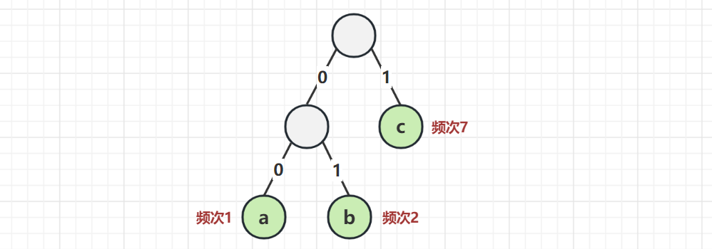

* 00 表示 a
* 01 表示 b
* 1 表示 c

现在还是传递 abbccccccc 这 10 个字符

* 实际的字节为 000101 1111111 （二进制表示）
* 总共需要 13 bits，这棵树就称之为 Huffman 树
* 根据 Huffman 树对字符和数字进行编解码，就是 Huffman 编解码


#### Huffman 树

```java
public class HuffmanTree {

    /*
        Huffman 树的构建过程

        1. 将统计了出现频率的字符，放入优先级队列

        2. 每次出队两个频次最低的元素，给它俩找个爹
        3. 把爹重新放入队列，重复 2~3
        4. 当队列只剩一个元素时，Huffman 树构建完成
     */

    static class Node {
        Character ch; // 字符
        int freq;     // 频次
        Node left;
        Node right;
        String code;  // 编码

        public Node(Character ch) {
            this.ch = ch;
        }

        public Node(int freq, Node left, Node right) {
            this.freq = freq;
            this.left = left;
            this.right = right;
        }

        int freq() {
            return freq;
        }

        boolean isLeaf() {
            return left == null;
        }

        @Override
        public String toString() {
            return "Node{" +
                    "ch=" + ch +
                    ", freq=" + freq +
                    '}';
        }
    }

    String str;
    Map<Character, Node> map = new HashMap<>();

    public HuffmanTree(String str) {
        this.str = str;
        // 功能1：统计频率
        char[] chars = str.toCharArray();
        for (char c : chars) {
            /*if (!map.containsKey(c)) {
                map.put(c, new Node(c));
            }
            Node node = map.get(c);
            node.freq++;*/
            Node node = map.computeIfAbsent(c, Node::new);
            node.freq++;
        }
        // 功能2: 构造树
        PriorityQueue<Node> queue = new PriorityQueue<>(Comparator.comparingInt(Node::freq));
        queue.addAll(map.values());
        while (queue.size() >= 2) {
            Node x = queue.poll();
            Node y = queue.poll();
            int freq = x.freq + y.freq;
            queue.offer(new Node(freq, x, y));
        }
        Node root = queue.poll();
        // 功能3：计算每个字符的编码, 功能4：字符串编码后占用 bits
        int sum = dfs(root, new StringBuilder());
        for (Node node : map.values()) {
            System.out.println(node + " " + node.code);
        }
        System.out.println("总共会占用 bits:" + sum);
    }

    private int dfs(Node node, StringBuilder code) {
        int sum = 0;
        if (node.isLeaf()) {
            node.code = code.toString();
            sum = node.freq * code.length();
        } else {
            sum += dfs(node.left, code.append("0"));
            sum += dfs(node.right, code.append("1"));
        }
        if (code.length() > 0) {
            code.deleteCharAt(code.length() - 1);
        }
        return sum;
    }

    public static void main(String[] args) {
        new HuffmanTree("abbccccccc");
    }
}
```

> ***注意***
>
> * Node::new 是一个 Function，根据 key（即字符）生成 Node 对象
> * 对应的是 public Node(Character ch) 有参构造


#### Huffman 编解码

补充两个方法，注意为了简单期间用了编解码都用字符串演示，实际应该按 bits 编解码

```java
public class HuffmanTree {
    // ...
    
    // 编码
    public String encode() {
        char[] chars = str.toCharArray();
        StringBuilder sb = new StringBuilder();
        for (char c : chars) {
            sb.append(map.get(c).code);
        }
        return sb.toString();
    }

    // 解码
    public String decode(String str) {
        /*
            从根节点，寻找数字对应的字符
                数字是 0 向左走
                数字是 1 向右走
                如果没走到头，每走一步数字的索引 i++
            走到头就可以找到解码字符，再将 node 重置为根节点
         */
        char[] chars = str.toCharArray();
        int i = 0;
        StringBuilder sb = new StringBuilder();
        Node node = root;
        while (i < chars.length) {
            if (!node.isLeaf()) { // 非叶子
                if(chars[i] == '0') { // 向左走
                    node = node.left;
                } else if(chars[i] == '1') { // 向右走
                    node = node.right;
                }
                i++;
            }
            if (node.isLeaf()) {
                sb.append(node.ch);
                node = root;
            }
        }
        return sb.toString();
    }
    
    @SuppressWarnings("all")
    public static void main(String[] args) {
        HuffmanTree tree = new HuffmanTree("abbccccccc");
        String encoded = tree.encode();
        System.out.println(encoded);
        System.out.println(tree.decode(encoded));
    }
}
```

> ***注意***
>
> * 循环中非叶子节点 i 要自增，但叶子节点 i 暂不自增
> * 第一个非叶子的 if 判断结束后，仍需要第二个叶子的 if 判断，因为在第一个 if 内 node 发生了变化


#### 相关题目

| 题目编号          | 题目标题           | 算法思路         |
| ----------------- | ------------------ | ---------------- |
| 1167（Plus 题目） | 连接棒材的最低费用 | Huffman 树、贪心 |


### 4) 活动选择问题

```java
public class ActivitySelectionProblem {

    /*
        要在一个会议室举办 n 个活动
        - 每个活动有它们各自的起始和结束时间
        - 找出在时间上互不冲突的活动组合，能够最充分利用会议室（举办的活动次数最多）

        例1
            0   1   2   3   4   5   6   7   8   9
                |-------)
                    |-------)
                        |-------)
        例2
            0   1   2   3   4   5   6   7   8   9
                |---)
                        |---)
            |-----------------------)
                                |-------)
                                            |---)
                                |---------------)


        几种贪心策略
        1. 优先选择持续时间最短的活动
            0   1   2   3   4   5   6   7   8   9
                |---------------)
                            |-------)
                                |---------------)

        2. 优先选择冲突最少的活动
            0   1   2   3   4   5   6   7   8   9
            |-------)                                       3
                |-------)                                   4
                |-------)                                   4
                |-------)                                   4
                    |-------)                               4
                        |-------)                           2
                            |-----------)                   4
                                    |-------)               4
                                    |-------)               4
                                    |-------)               4
                                        |-------)           3

        3. 优先选择最先开始的活动
            0   1   2   3   4   5   6   7   8   9
            |-----------------------------------)
                |---)
                    |---)
                        |---)

        4. 优先选择最后结束的活动
     */

    static class Activity {
        int index;
        int start;
        int finish;

        public Activity(int index, int start, int finish) {
            this.index = index;
            this.start = start;
            this.finish = finish;
        }

        @Override
        public String toString() {
            return "Activity(" + index + ")";
        }
    }

    public static void main(String[] args) {
        Activity[] activities = new Activity[]{
                new Activity(0, 1, 3),
                new Activity(1, 2, 4),
                new Activity(2, 3, 5)
        };
//        Activity[] activities = new Activity[]{
//                new Activity(0, 1, 2),
//                new Activity(1, 3, 4),
//                new Activity(2, 0, 6),
//                new Activity(3, 5, 7),
//                new Activity(4, 8, 9),
//                new Activity(5, 5, 9)
//        };
        select(activities, activities.length);
    }

    public static void select(Activity[] activities, int n) {
        List<Activity> result = new ArrayList<>();
        int i, j;
        i = 0;
        result.add(activities[i]);
        for (j = 1; j < n; j++) {
            if (activities[j].start >= activities[i].finish) {
                result.add(activities[j]);
                i = j;
            }
        }
        System.out.println(result);
    }
}
```


#### 相关题目

| 题目编号 | 题目标题   | 算法思路 |
| -------- | ---------- | -------- |
| 435      | 无重叠区间 | 贪心     |

题解

```java
// 下面代码为 Leetcode 435 题解
public int eraseOverlapIntervals(int[][] intervals) {
    Arrays.sort(intervals, Comparator.comparingInt(a -> a[1]));
    int i, j;
    i = 0;
    int count = 1;
    for (j = 1; j < intervals.length; j++) {
        if (intervals[j][0] >= intervals[i][1]) {
            i = j;
            count++;
        }
    }
    return intervals.length - count;
}
```

* 找到不重叠的最多的活动数（count），即活动选择问题原始需求
* 在此基础上，活动总数 - count，就是题目要的排除数量


### 5) 分数背包问题

#### 贪心法

```java
public class FractionalKnapsackProblem {

    /*
    1. n个物品都是液体，有重量和价值
    2. 现在你要取走 10升 的液体
    3. 每次可以不拿，全拿，或拿一部分，问最高价值是多少

        编号 重量(升) 价值
        0   4       24      水
        1   8       160     牛奶       选中 7/8
        2   2       4000    五粮液     选中
        3   6       108     可乐
        4   1       4000    茅台       选中

        8140

        简化起见，给出的数据都是【价值/重量】能够整除，避免计算结果中出现小数，增加心算难度
     */

    static class Item {
        int index;
        int weight;
        int value;

        public Item(int index, int weight, int value) {
            this.index = index;
            this.weight = weight;
            this.value = value;
        }

        int unitPrice() {
            return value / weight;
        }

        @Override
        public String toString() {
            return "Item(" + index + ")";
        }
    }

    public static void main(String[] args) {
        Item[] items = new Item[]{
                new Item(0, 4, 24),
                new Item(1, 8, 160),
                new Item(2, 2, 4000),
                new Item(3, 6, 108),
                new Item(4, 1, 4000),
        };
        select(items, 10);
    }

    static void select(Item[] items, int total) {
        Arrays.sort(items, Comparator.comparingInt(Item::unitPrice).reversed());
        int remainder = total;
        int max = 0;
        for (Item item : items) {
            if (remainder - item.weight > 0) {
                max += item.value;
                remainder -= item.weight;
            } else {
                max += remainder * item.unitPrice();
                break;
            }
        }
        System.out.println("最高价值为：" + max);
    }


}
```


### 6) 0-1 背包问题

#### 贪心法

可能得不到最优解

```java
public class KnapsackProblem {
    /*
    1. n个物品都是固体，有重量和价值
    2. 现在你要取走不超过 10克 的物品
    3. 每次可以不拿或全拿，问最高价值是多少

        编号 重量(g)  价值(元)
        0   1       1_000_000      钻戒一枚
        1   4       1600           黄金一块
        2   8       2400           红宝石戒指一枚
        3   5       30             白银一块

     */

    static class Item {
        int index;
        int weight;
        int value;

        public Item(int index, int weight, int value) {
            this.index = index;
            this.weight = weight;
            this.value = value;
        }

        public int unitValue() {
            return value / weight;
        }

        @Override
        public String toString() {
            return "Item(" + index + ")";
        }
    }

    public static void main(String[] args) {
        Item[] items = new Item[]{
                new Item(0, 1, 1_000_000),
                new Item(1, 4, 1600),
                new Item(2, 8, 2400),
                new Item(3, 5, 30)
        };
        select(items, 10);
    }

    static void select(Item[] items, int total) {
        Arrays.sort(items, Comparator.comparingInt(Item::unitValue).reversed());
        int max = 0; // 最大价值
        for (Item item : items) {
            System.out.println(item);
            if (total >= item.weight) { // 可以拿完
                total -= item.weight;
                max += item.value;
            } else { // 拿不完
//                max += total * item.unitValue();
//                break;
            }
        }
        System.out.println("最大价值是:" + max);
    }
}
```


### 贪心算法的局限

| 问题名称             | 是否能用贪心得到最优解 | 替换解法     |
| -------------------- | ---------------------- | ------------ |
| Dijkstra(不存在负边) | ✔️                      |              |
| Dijkstra(存在负边)   | ❌                      | Bellman-Ford |
| Prim                 | ✔️                      |              |
| Kruskal              | ✔️                      |              |
| 零钱兑换             | ❌                      | 动态规划     |
| Huffman 树           | ✔️                      |              |
| 活动选择问题         | ✔️                      |              |
| 分数背包问题         | ✔️                      |              |
| 0-1 背包问题         | ❌                      | 动态规划     |


## 3. 算法设计 - Dynamic-Programming


# 二. 习题


