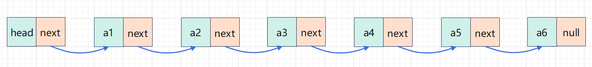
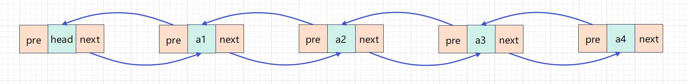
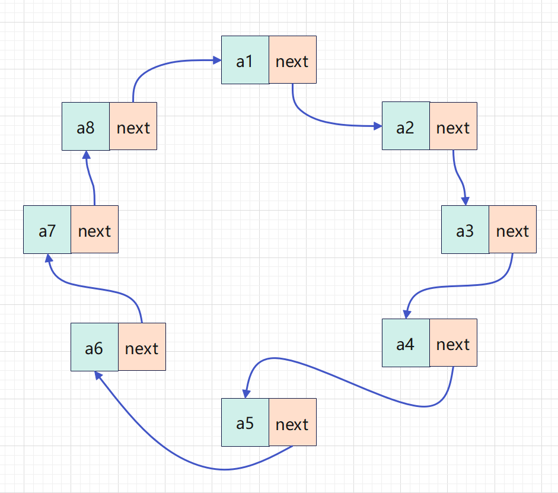
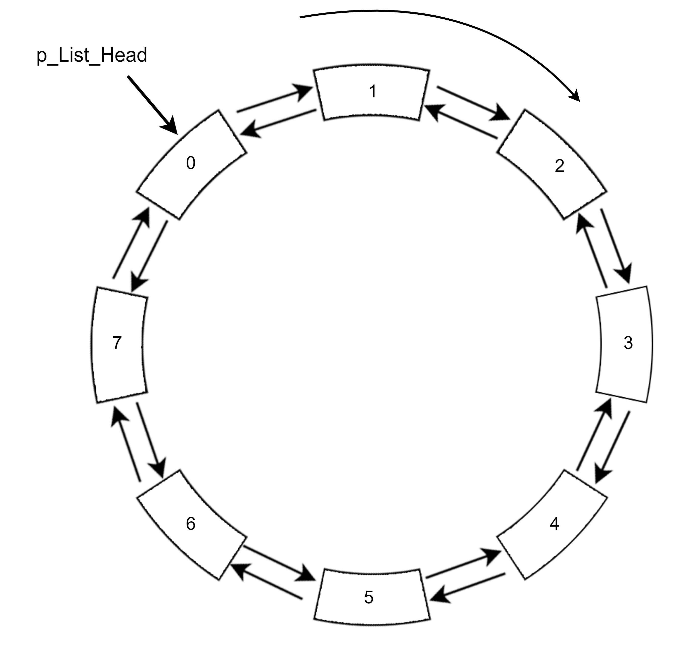
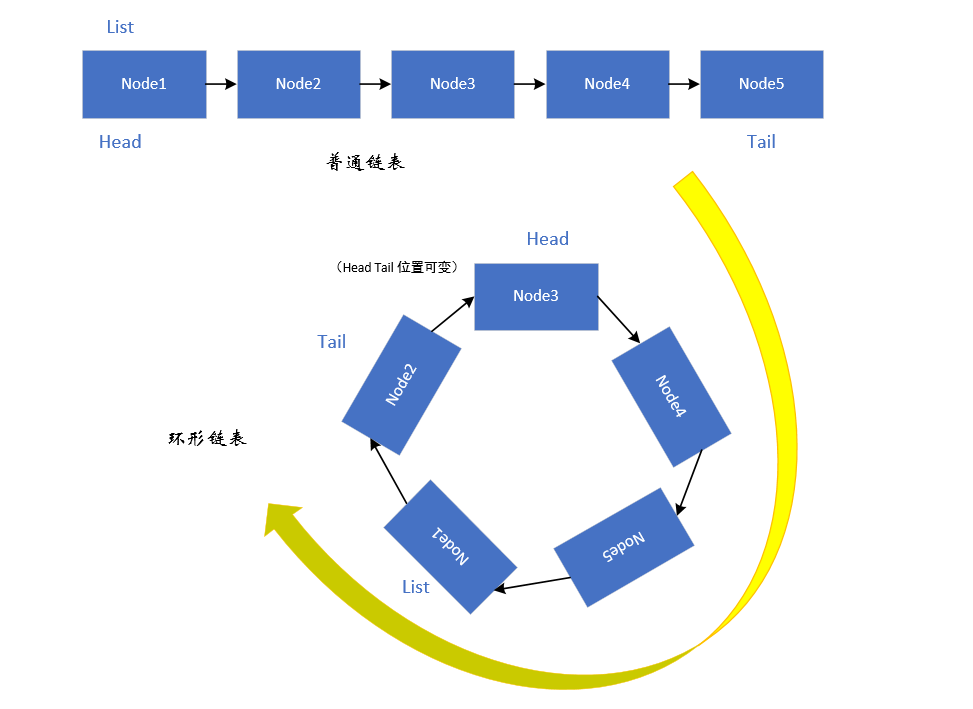

# 链表

> n个节点离散分配，彼此通过指针相连，每个节点只有一个前驱节点，每个节点只有一个后续节点，首节点没有前驱节点，尾节点没有后续节点。确定一个链表我们只需要头指针，通过头指针就可以把整个链表都能推出来

## 链表优点

+ 空间没有限制
+ 插入删除元素很快

## 链表缺点

+ 存取速度很慢

## 分类

+ 单向链表 一个节点指向下一个节点。

+ 双向链表 一个节点有两个指针域。

+ 环形链表 能通过任何一个节点找到其他所有的节点，将两种(双向/单向)链表的最后一个结点指向第一个结点从而实现循环。

### 单链表

### 双链表

### 单向环形链表

### 双向环形链表

