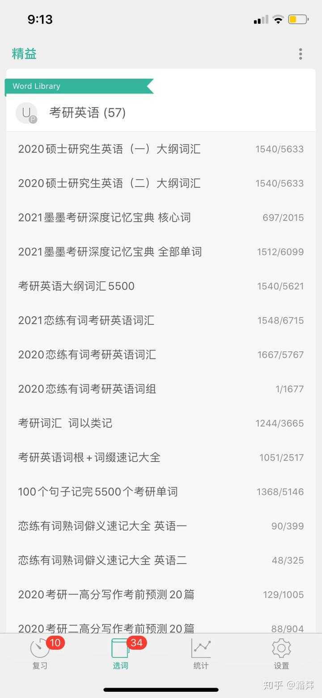
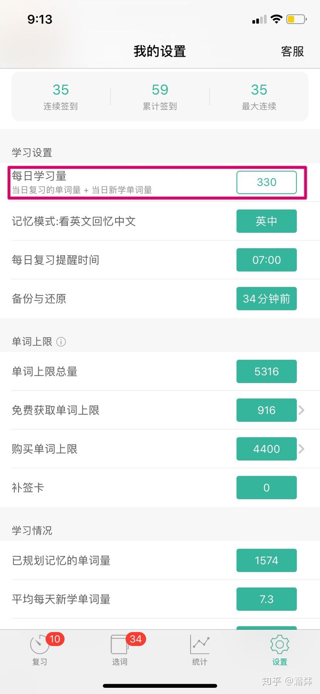
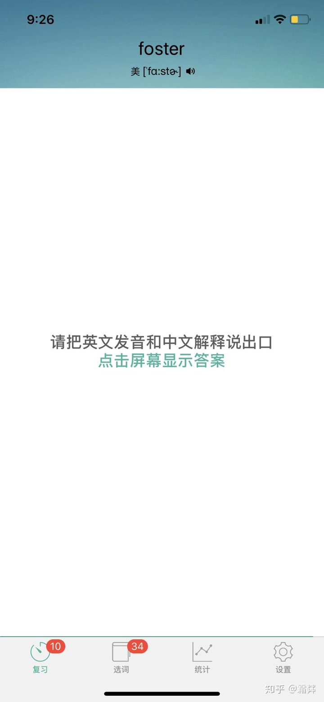
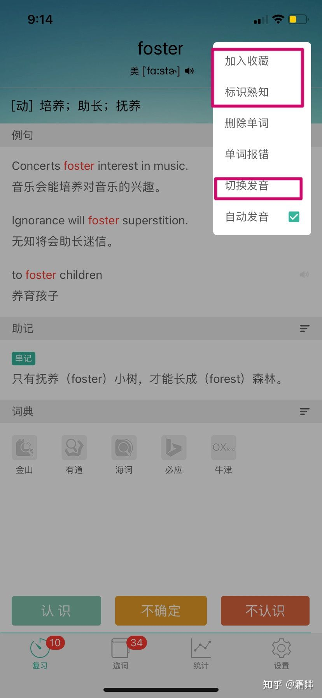
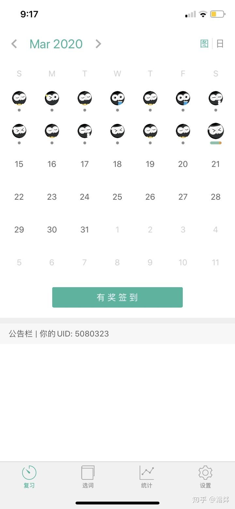
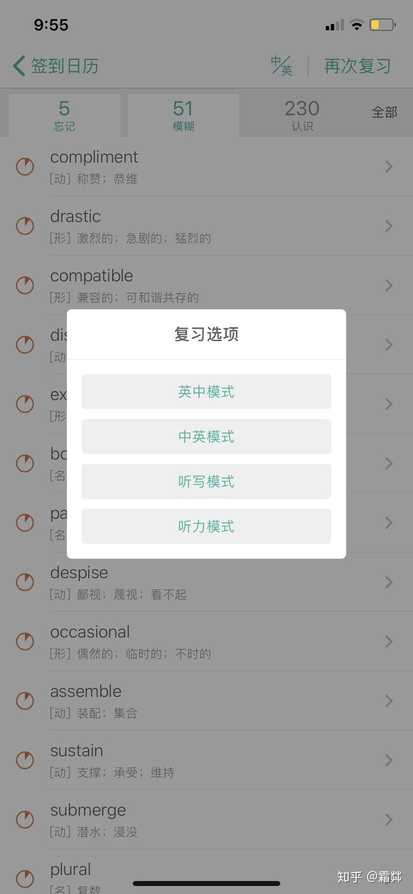
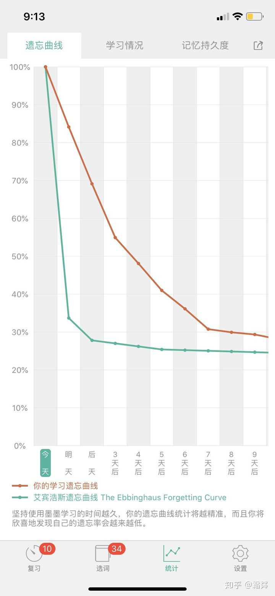
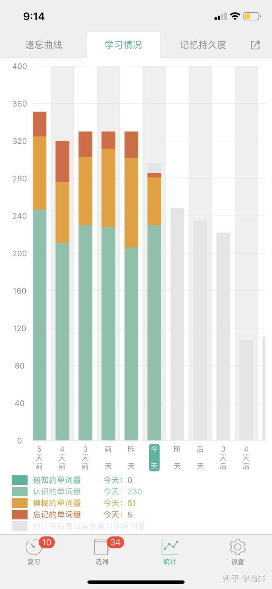
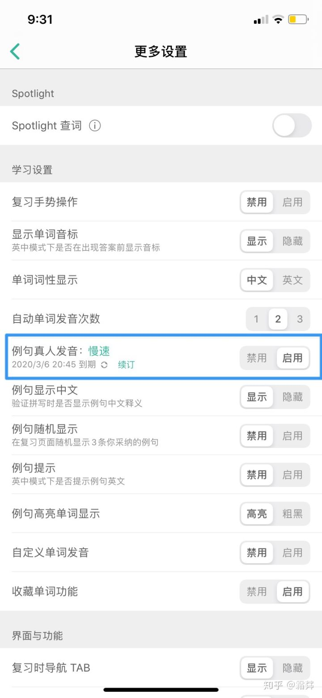
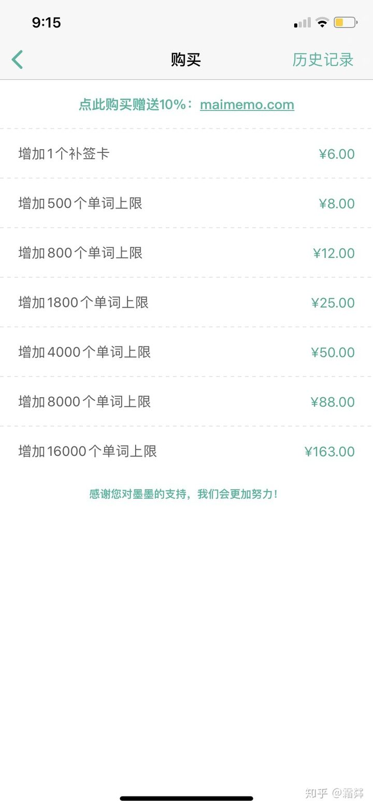

+ 使用技巧

###  第一步：选择一本单词书，如下图，它有很多分类，我就拿考研的来举例了。




### 第二步：在第四个角标“设置”里头选择每日学习目标量

```shell
免费送600词汇量，在签到和分享过程中也会一直赠送的，虽然量不多，至少是送了！
不够就买起来，这里确实会有一些朋友觉得单词收费略微昂贵，但是你想想如果你是app开发人或者是其中的工作人员之一，
会不会也希望以某一些方式来获益，而且你买了单词其实就是一种知识付费和你买单词书是一样的，
它比单词书好的地方是：
1⃣️能送你单词量，也就是只要你坚持打卡分享你的免费单词量是会越来越多；
2⃣️词书多即选择多，还能随时搜索忘记的单词；
3⃣️根据你的学习来提醒你复习（超级人性化，也不用另外去看表格想我今天该复习哪个单元了，该复习多少词汇量了）
4⃣️动力动力，花钱了还不学，钱太多啊！刚开始建议少一点，
因为这个app是根据艾宾浩斯遗忘曲线来学习和复习的，因此你每次学习完它都会根据你之前的学习情况来给你安排学习任务，也就是说，
比如我图上330个词其中276个是我之前学习过了的单词，而剩下的54个就是我今天需要新学的单词！）
```



### 第三部：回到第一个“复习”界面，开始背单词啦！

```shell
上面会有提示文，你先看这个单词你认不认识，认识你可以自己口述一下它的意思然后点击页面进行核对，点开页面下标：
认识；模糊；不认识。
词义无误选认识（哈哈哈说什么废话）有偏差选模糊（dbq还是废话）不认识就不认识了哦！
这里一定一定要对自己诚实，认真选择！不会多看几遍就会了！
每个单词会出现3次，3次也会慢慢有印象的，第三次还不会也没关系明天还会再让你学！✌️
```



```shell
在背词的过程中可能会出现的情况
1.你非常熟悉的单词那么就在右上角的三个小点点里头点击熟识就ok啦；
2.你学的是英（美）音也是在小点点里切换哈！
3.词义不够（补充啊，自己上！点击词义那一行最右图标在前面输入adj、v……系统都会自动识别的哈，每个词之间记得用；隔开（中文格式哦）这样编辑完成后回到界面就是和正常的一样啦！（我们真棒 ）
4.例句不够典型，点击例句那一行的长短线段图标就可以看到更多的例句啦！把你不想要的☑️取消换成你喜欢的例句就OK！（只能有3个例子哦）
```




### 第四部：背完单词，签到签到签到！

```shell
一定要peng一下哦（真的很大声哈哈哈），
然后我会在“统计”的界面看看自己今天和之前的学习情况，做一下对比～然后就是复习啦（我经常是溜之大吉哈哈哈第二天再复习），
如果你想今天在复习也是完全可以的！点击今天的小图标，
然后会出现“查看详情”字样，点击复习，
再在右上角中选择你喜欢的复习模式就ok啦！
```










### “奇奇怪怪”的提醒

```dos
1:设置页面下拉到最后的更多设置里可以免费享用7天的例句发音哦！

2:购买单词一定要点上面的链接能多送一些单词（我快乐了）

3:然后......没有了！哈哈哈！
```





