### 一:大家熟悉的操作系统

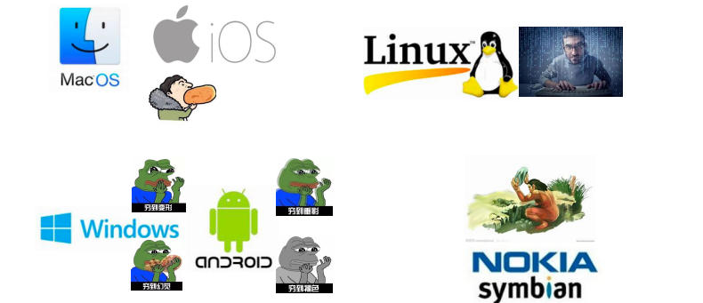


### 二:知识总览


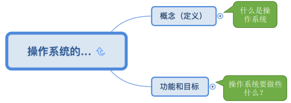


+ 1:操作系统的概念（定义）

> 操作系统（Operating System， OS）是指控制和管理整个计算机系统的硬件和软件资源，并合理地组织调
  度计算机的工作和资源的分配；以提供给用户和其他软件方便的接口和环境；它是计算机系统中最基本
  的系统软件。
  
  
+ 直观的例子：打开 Windows 操作系统的“任务管理器”（快捷键：Ctrl+Alt+Del）

+ ①操作系统是系统资源的管理者

+ ②向上层提供方便易用的服务

+ ③是最接近硬件的一层软件

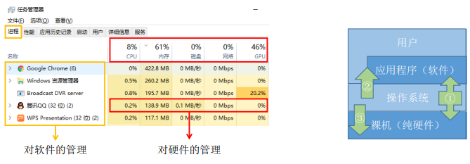


```
一台电脑的诞生~
Step 1：厂家组装一台裸机
Step 2：出售前安装操作系统
Step 3：用户安装应用程序（eg：QQ）
Step 4：使用 QQ 聊天
```

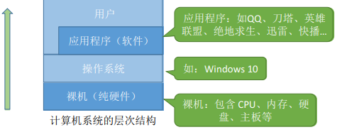


+ 2:操作系统的功能和目标——作为系统资源的管理者

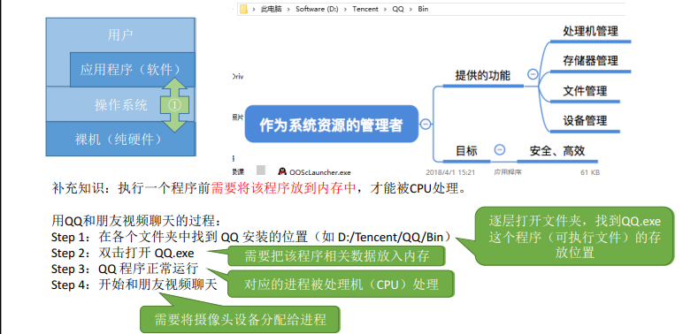


+ 操作系统的功能和目标——向上层提供方便易用的服务

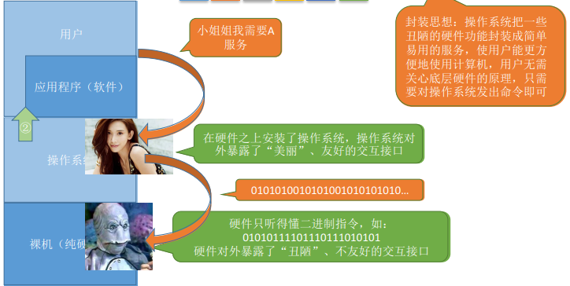


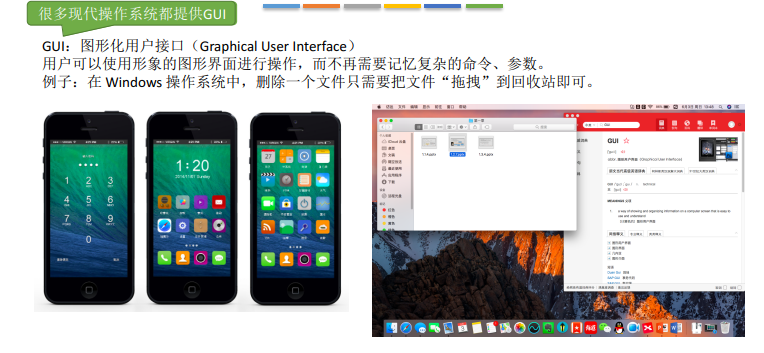


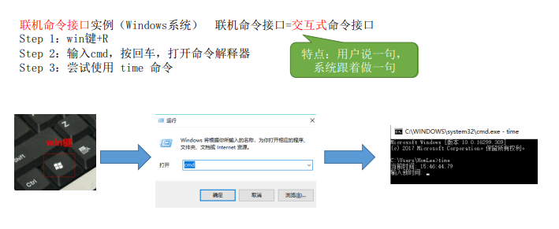


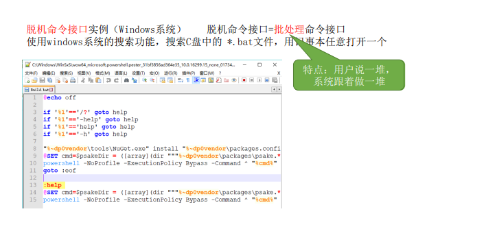


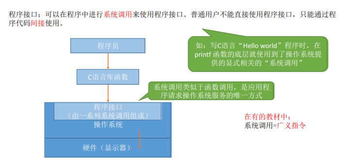


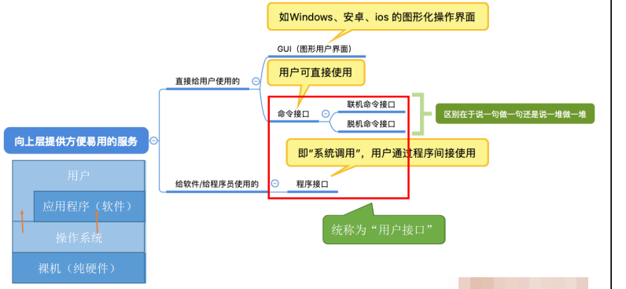


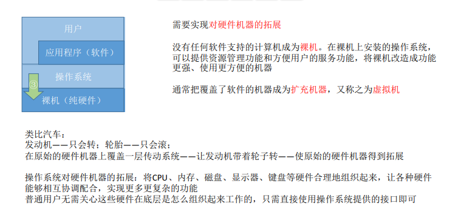


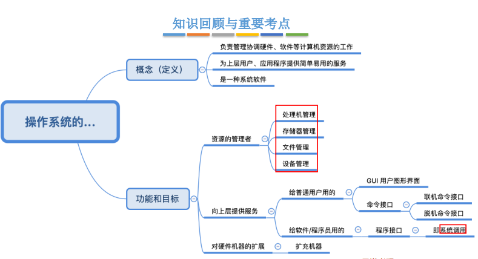


