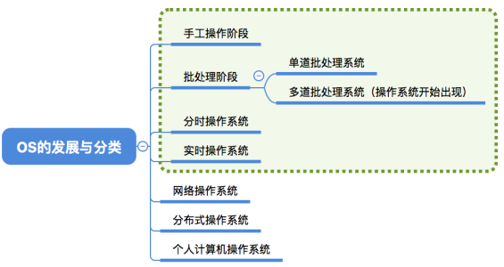
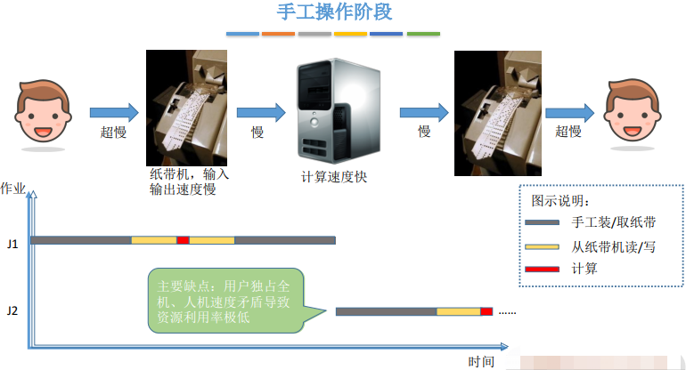
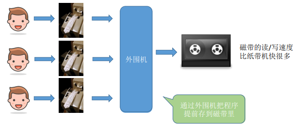
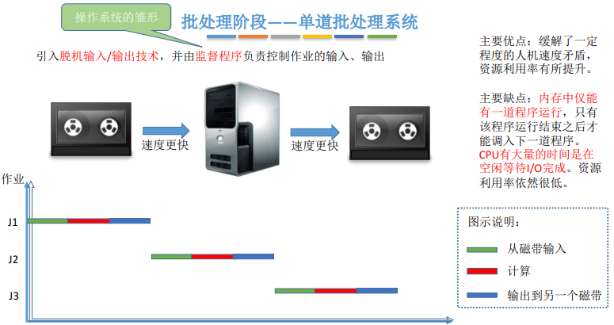
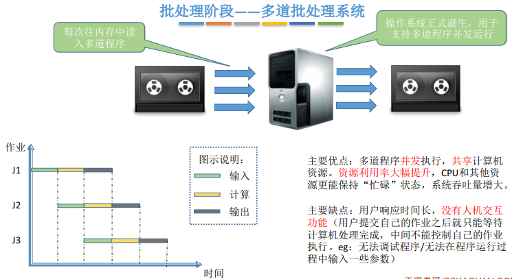
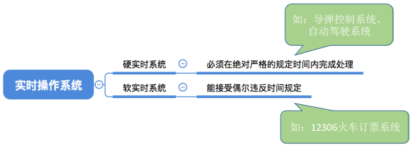
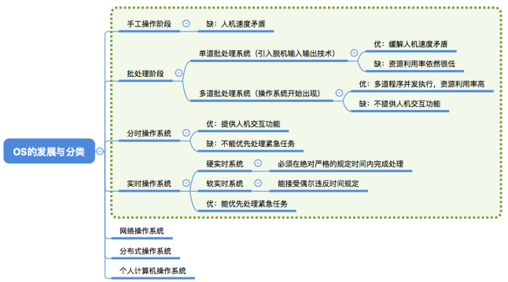

### 一:知识总览

### 二:分类描述

+ 1:手工操作阶段

+ 2:批处理阶段——单道批处理系统

> 引入脱机输入/输出技术（用外围机+磁带完成），并由监督程序负责控制作业的输入、输出

> 和上面不同的是不必等结果输出在执行而是计算机执行完毕马上将结果输入磁带中并在同事已经开始执行其它数据程序

+ 3:批处理阶段——多道批处理系统

+ 4:分时操作系统

+ 5:实时操作系统

* 主要优点：能够优先响应一些紧急任务，某些紧急任务不需时间片排队。在实时操作系统的控制下，计算机系统接收到外部信号后及时进行处理，并且要在严格的时限内处理完事件。实时操作系统的主要特点是及时性和可靠性

### 三:其他几种操作系统

+ 网络操作系统：是伴随着计算机网络的发展而诞生的，能把网络中各个计算机有机地结合起来，实现数据传送等功能，实现网络中各种资源的共享（如文件共享）和各台计算机之间的通信。（如：Windows NT 就是一种典型的网络操作系统，网站服务器就可以使用）
+ 分布式操作系统：主要特点是分布性和并行性。系统中的各台计算机地位相同，任何工作都可以分布在这些计算机上，由它们并行、协同完成这个任务。
+ 个人计算机操作系统：如 Windows XP、MacOS，方便个人使用。

### 四:知识回顾与重要考点

