##  运行机制 

### 一: 知识总览

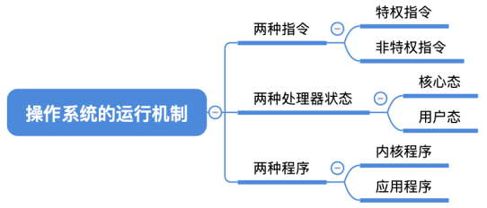

### 二: 预备知识：程序是如何运行的？

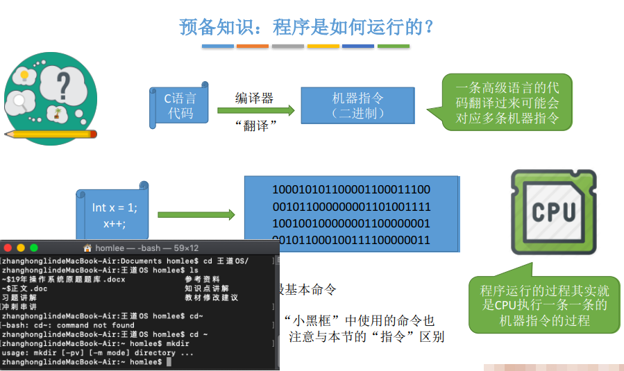

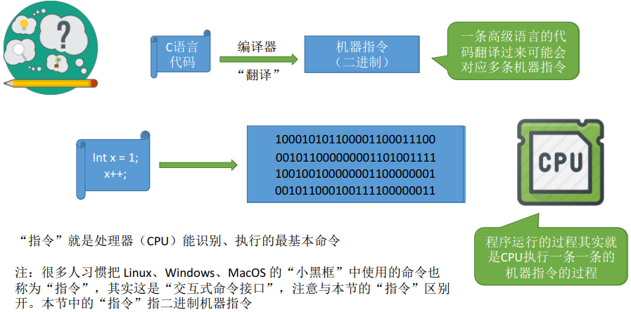

### 三:内核程序 v.s. 应用程序

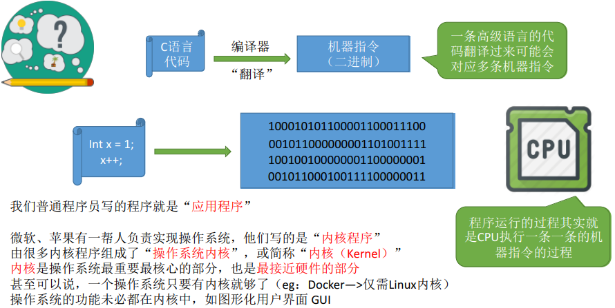

### 四:特权指令 v.s. 非特权指令

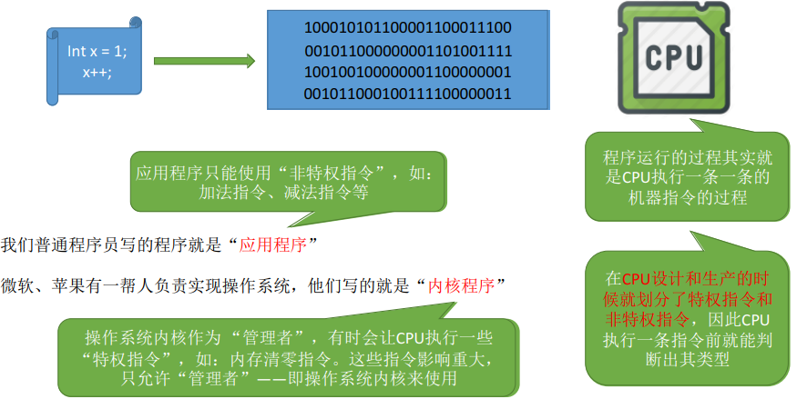

### 五:内核态 v.s. 用户态

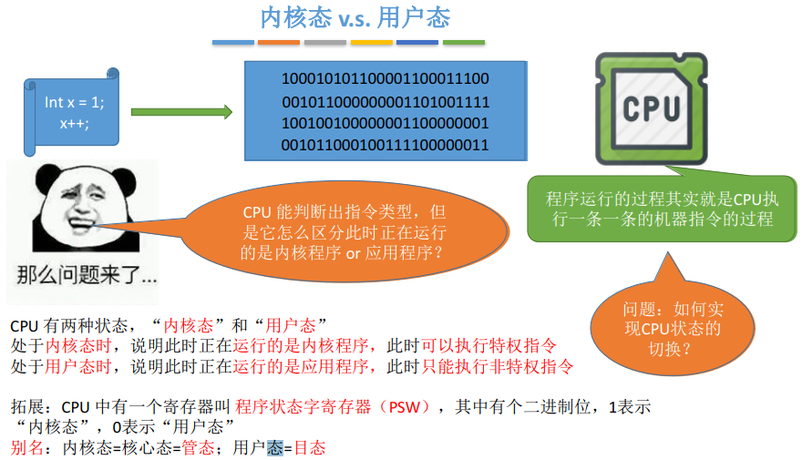

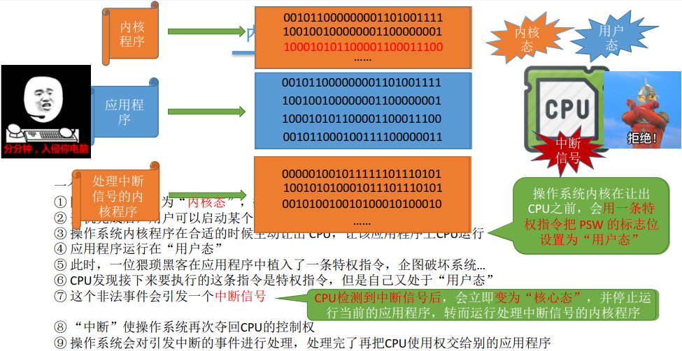

### 六:内核态、用户态 的切换

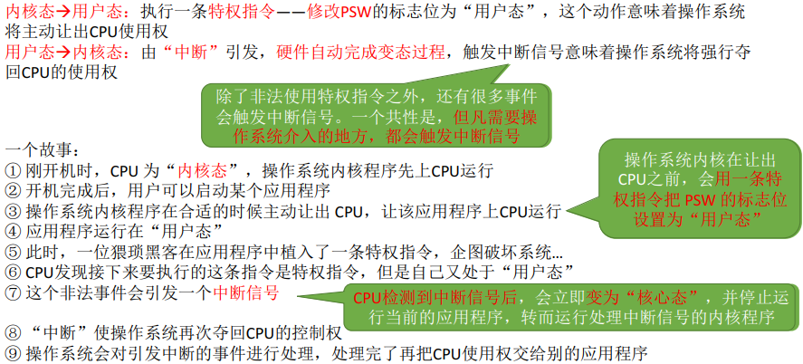

### 知识回顾与重要考点

##  体系结构

### 两种指令、两种处理器状态、两种程序

 
 
 
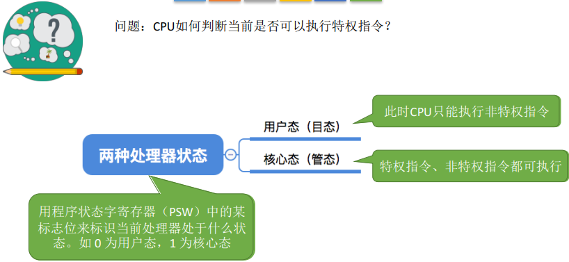

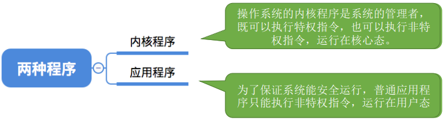

### 操作系统的内核

> Yo~生活经验：我们安装完 Windows 操作系统后，会发现操作系统提供了多种多样的功能，比如“记事本”、
  “任务管理器”。然而，这些功能并不是必不可少的。即使没有“任务管理器”，我们仍然可以使用计算机。

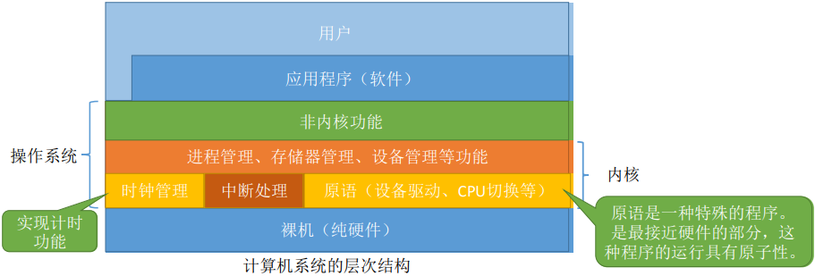

+ 内核是计算机上配置的底层软件，是操作系统最基本、最核心的部分。实现操作系统内核功能的那些程序就是内核程序。

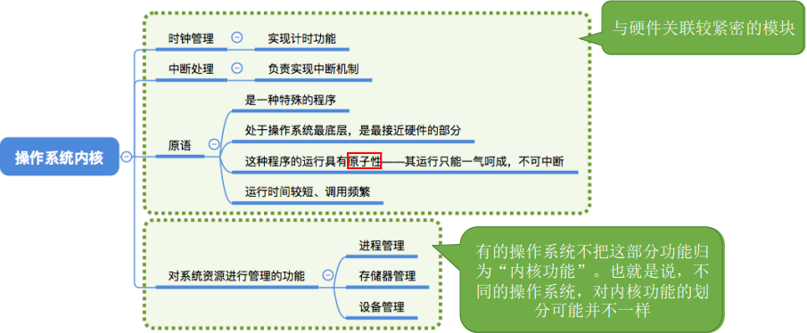

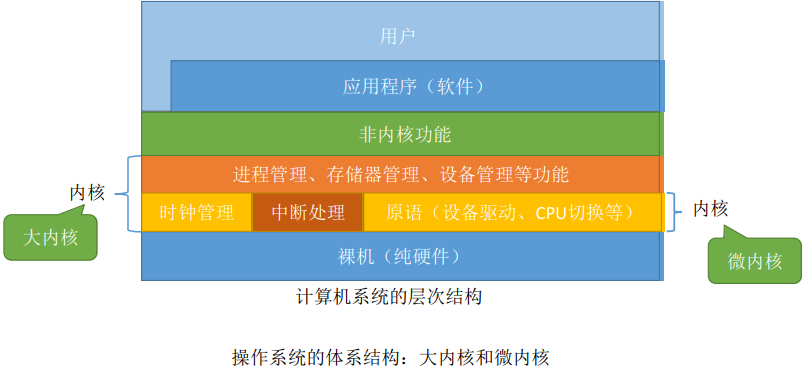

+ 计算机系统的层次结构

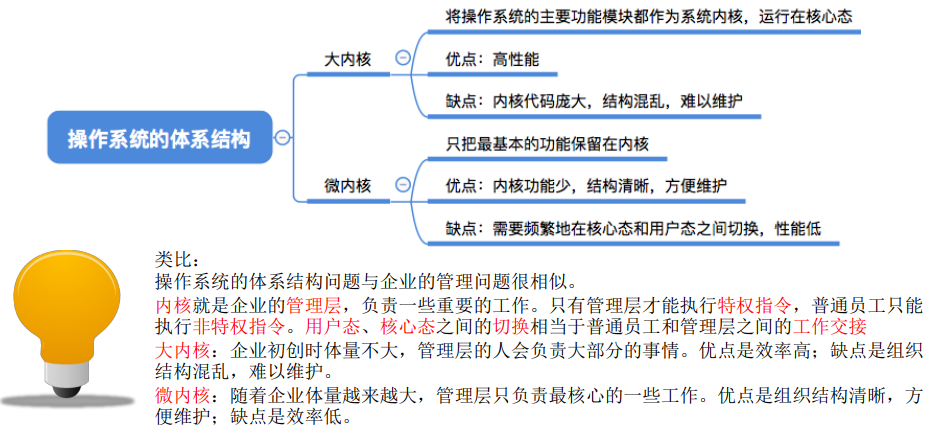

### 知识回顾与重要考点

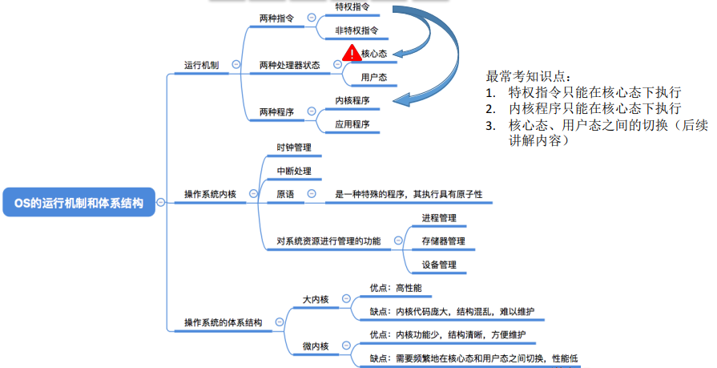

 