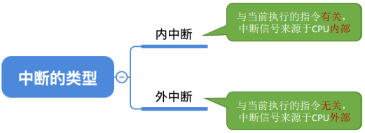
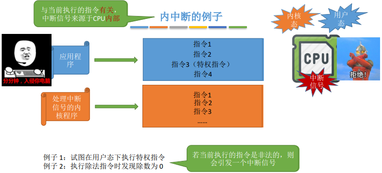
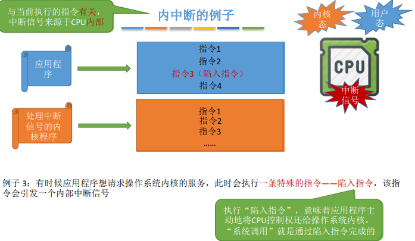
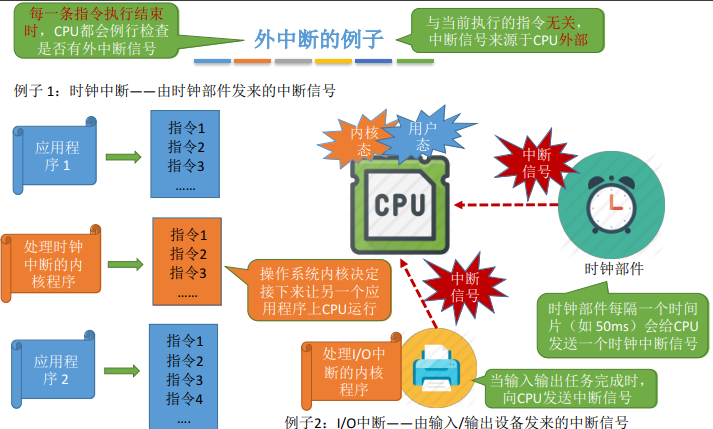
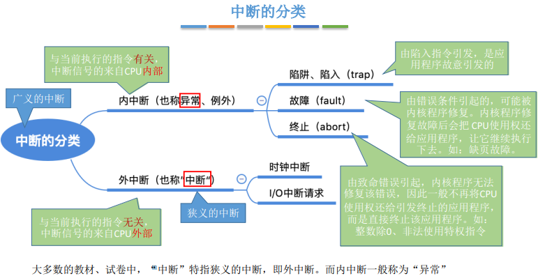
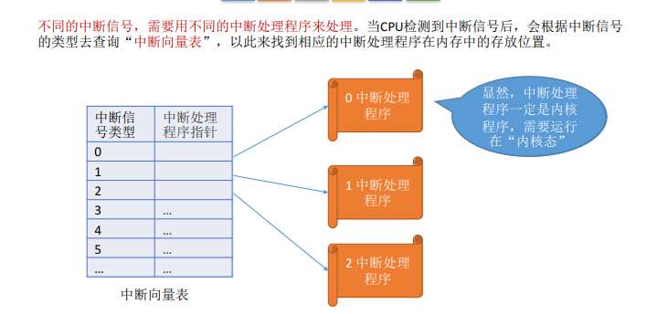
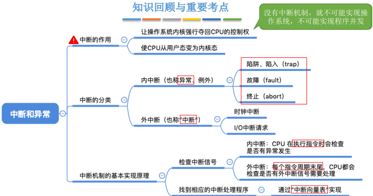

### 一:知识总览

#### 中断的作用

> “中断”会使CPU由用户态变为内核态，使操作系统重新夺回对CPU的控制权

+ CPU 上会运行两种程序，一种是操作系统内核程序，一种是应用程序

+ 在合适的情况下，操作系统内核会把CPU的使用权主动让给应用程序(进程管理相关内容)

+ 如果没有“中断”机制，那么一旦应用程序上CPU运行，CPU就会一直运行这个应用程序

* 内核态à用户态：执行一条特权指令——修改PSW的标志位为“用户态”，这个动作意味着操作系统将主动让出CPU使用权

* 用户态à内核态：由“中断”引发，硬件自动完成变态过程，触发中断信号意味着操作系统将强行夺回CPU的使用权

#### 中断的类型

#### 中断机制的基本原理

### 二:知识回顾与重要考点 

