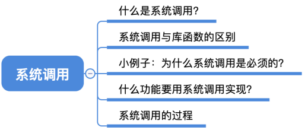
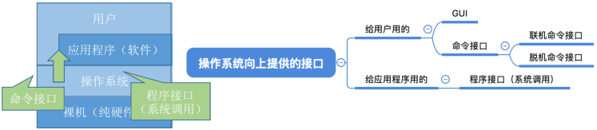
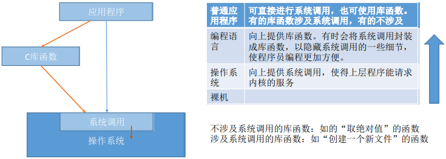
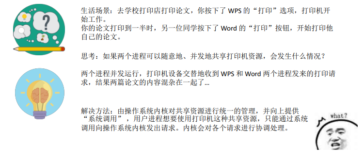
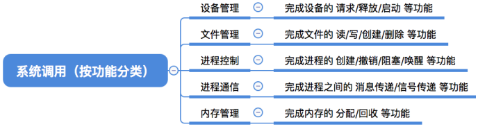
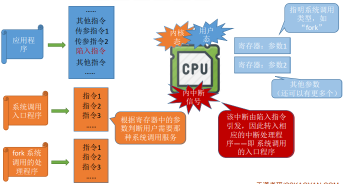
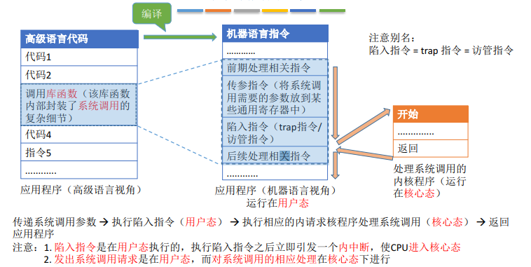
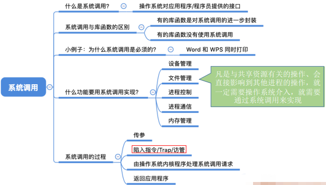

### 一:知识总览

#### 什么是系统调用，有何作用？

> 知识点回顾：操作系统作为用户和计算机硬件之间的接口，需要向上提供一些简单易用的服务。主要包括命令接口和程序接口。其中，程序接口由一组系统调用组成。

> “系统调用”是操作系统提供给应用程序（程序员/编程人员）使用的接口，可以理解为一种可供应用程序调用的特殊函数，应用程序可以通过系统调用来请求获得操作系统内核的服务
  
  
 #### 系统调用与库函数的区别
 
 
 
 
#### 小例子：为什么系统调用是必须的？

 
 
 
 
#### 什么功能要用到系统调用？

> 应用程序通过系统调用请求操作系统的服务。而系统中的各种共享资源都由操作系统内核统一掌管，因此凡是与共享资源有关的操作（如存储分配、I/O操作、文件管理等），都必须通过系统调用的方式向操作系统内核提出服务请求，由操作系统内核代为完成。这样可以保证系统的稳定性和安全性，防止用户进行非法操作。

 
 
 
#### 系统调用的过程

 
 
 
 
  
  
  
  
### 二:知识回顾与重要考点

 
 
