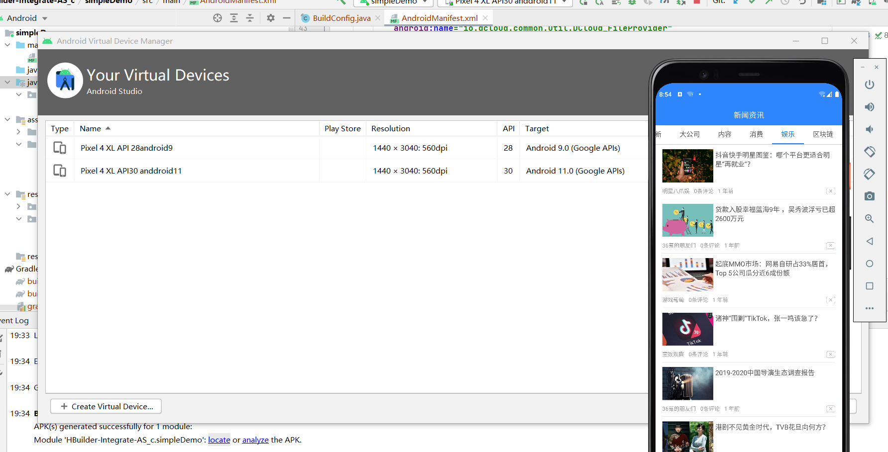

## android本地打包

[参考1](https://wangjinchan.blog.csdn.net/article/details/120486710)
[参考2](https://blog.csdn.net/will_csdn_go/article/details/116233294)
[参考3](https://blog.csdn.net/IOT_AI/article/details/106617626)

[uniapp创建keystore jks 参考](https://blog.csdn.net/will_csdn_go/article/details/116234619)
+ 这里是因为创建密匙文件有多种方式

### 第一步 下载 Android Studio 配置必要的数据
+ 1) 配置 android sdk 选用google 可以官网下载也可以使用工具下载
+ 2) 配置  jdk ( java jdk建议)
+ 3) 假如你没有手机或者手机不在打包环境那么你需要配置模拟android平台



### 第二部(重要)
> 我也是在网上找了下，发现网上的有残缺吧

+ 1:HBuilderX版本 必须和 sdk一致

[uniapp本地打包下载地址](https://nativesupport.dcloud.net.cn/AppDocs/download/android?id=_2021%e5%b9%b411%e6%9c%8822%e6%97%a5%e5%8f%91%e5%b8%83hbuilderx%ef%bc%88321620211122%ef%bc%89)

+ 2: Android Studio导入HBuilder-Integrate-AS

+ 3:删除 HBuilder-Integrate-AS_c\simpleDemo\src\main\assets\apps 下的 生成的包

+ 4: 生成签名

```dos
C:\Windows\system32>c:

C:\Windows\system32>cd C:\Program Files\Java\jdk1.8.0_102\bin

C:\Program Files\Java\jdk1.8.0_102\bin>keytool -genkey -alias test -keyalg RSA -keysize 2048 -validity 36500 -keystore test.keystore

输入密钥库口令:
再次输入新口令:
您的名字与姓氏是什么?
  [Unknown]:  z
您的组织单位名称是什么?
  [Unknown]:  z
您的组织名称是什么?
  [Unknown]:  z
您所在的城市或区域名称是什么?
  [Unknown]:  z
您所在的省/市/自治区名称是什么?
  [Unknown]:  z
该单位的双字母国家/地区代码是什么?
  [Unknown]:  z
CN=z, OU=z, O=z, L=z, ST=z, C=z是否正确?
  [否]:  y

输入 <test> 的密钥口令
        (如果和密钥库口令相同, 按回车):

C:\Program Files\Java\jdk1.8.0_102\bin>keytool -list -v -keystore test.keystore
输入密钥库口令:

密钥库类型: JKS
密钥库提供方: SUN

您的密钥库包含 1 个条目

别名: test
创建日期: 2021-12-4
条目类型: PrivateKeyEntry
证书链长度: 1
证书[1]:
所有者: CN=z, OU=z, O=z, L=z, ST=z, C=z
发布者: CN=z, OU=z, O=z, L=z, ST=z, C=z
序列号: 1af7ad82
有效期开始日期: Sat Dec 04 12:30:35 CST 2021, 截止日期: Mon Nov 10 12:30:35 CST 2121
证书指纹:
         MD5: 66:3B:24:19:6D:84:19:1E:A3:FC:A1:55:18:36:12:1F
         SHA1: E1:E7:F7:EB:13:81:87:E1:31:AF:67:40:B8:9C:6C:71:77:69:7D:84
         SHA256: 92:00:0B:D4:7A:40:11:16:80:B9:70:D9:3E:02:C8:0A:8F:CF:B7:1A:04:16:AC:AC:D5:E8:50:31:92:68:33:2D
         签名算法名称: SHA256withRSA
         版本: 3

扩展:

#1: ObjectId: 2.5.29.14 Criticality=false
SubjectKeyIdentifier [
KeyIdentifier [
0000: 7F C3 B2 D4 0B 79 96 A0   54 1C D7 49 FE 1A BE 87  .....y..T..I....
0010: BB 9B A3 A3                                        ....
]
]


*******************************************
*******************************************

```

+ 5 将 jdk环境下生成的test.keystore找到并复制到HBuilder-Integrate-AS_c\simpleDemo\test.keystore

+ 6: 回到刚才的黑窗子，查看sha1的指纹

+ 7:生成appKey https://dev.dcloud.net.cn/ 去生成

```
需要 APPID 如__UNI__6A9874D 必须一致
需要 Android 包名 如com.android.simple 必须和Android Studio中项目一致不能乱填
需要 Android 证书签名SHA1 必须一致
```

+ 8 到HBuilderX中打包 原生app本地打包 得到打包文件后将web包拷贝到HBuilder-Integrate-AS_c\simpleDemo\src\main\assets\apps 下

+ 9 需要修改的地方

```
dcloud_control.xml 中
<hbuilder>
<apps>
    <app appid="__UNI__6A9874D" appver=""/>
</apps>
</hbuilder>


AndroidManifest.xml 中
<meta-data
            android:name="dcloud_appkey"
            android:value="3f4b0a2ece1e41eb2a6e25cbf36e8f8c" />
            
build.gradle 中
 signingConfigs {
        config {
            keyAlias 'test'
            keyPassword '123456'
            storeFile file('test.keystore')
            storePassword '123456'
            v1SigningEnabled true
            v2SigningEnabled true
        }
    }
```

+ 10完毕 点击打包apk

[github地址](https://github.com/huachengzhou/uniapp-integrate-as_c.git)


## 服务端打包

## ios本地打包

